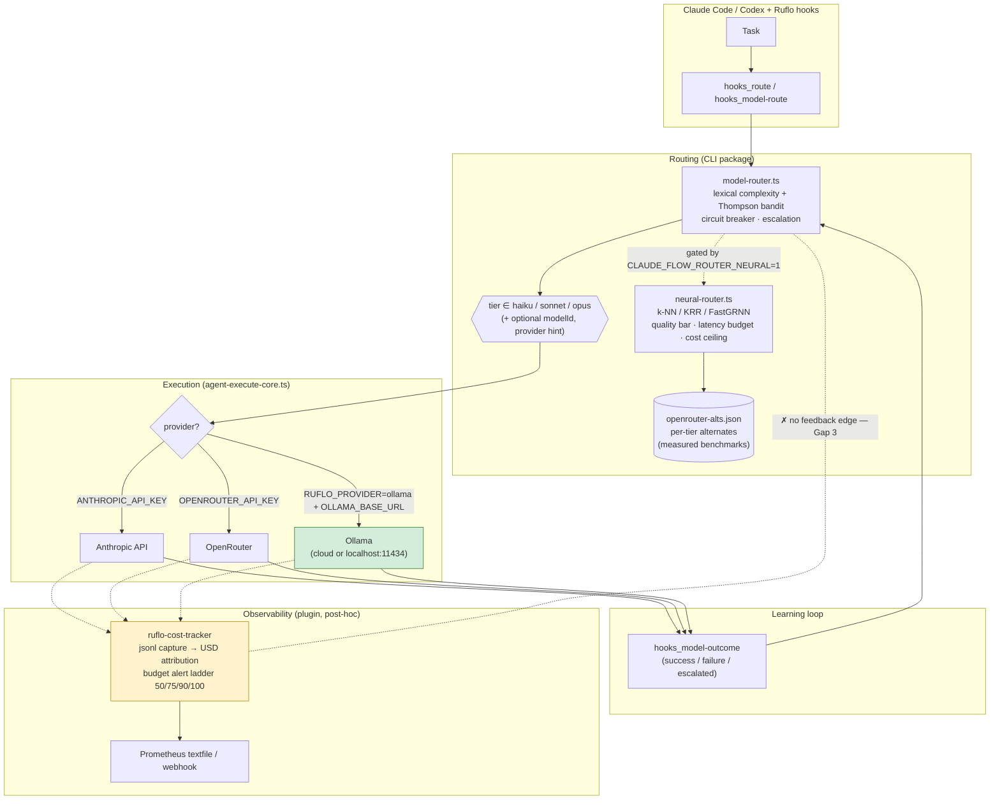
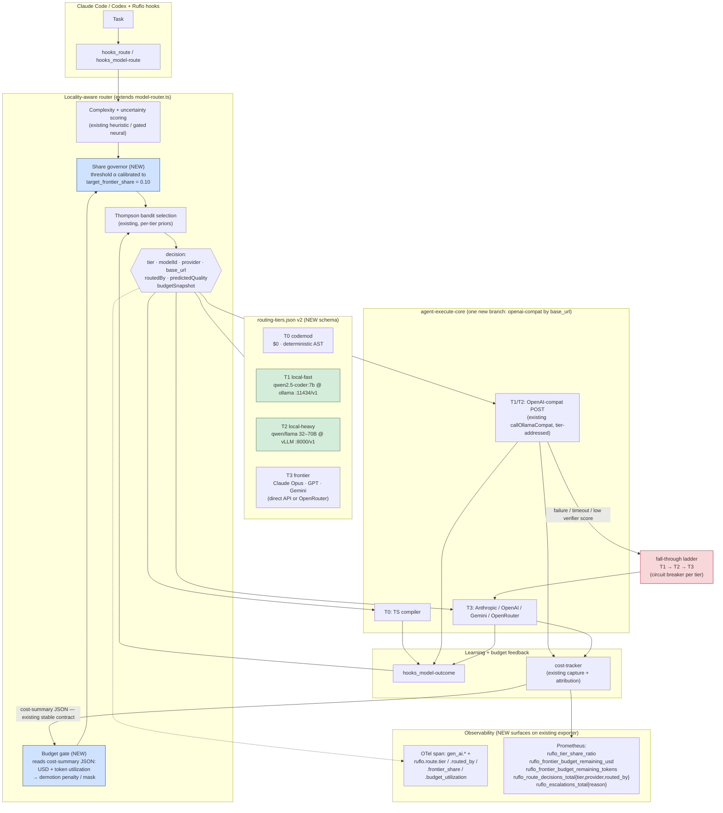
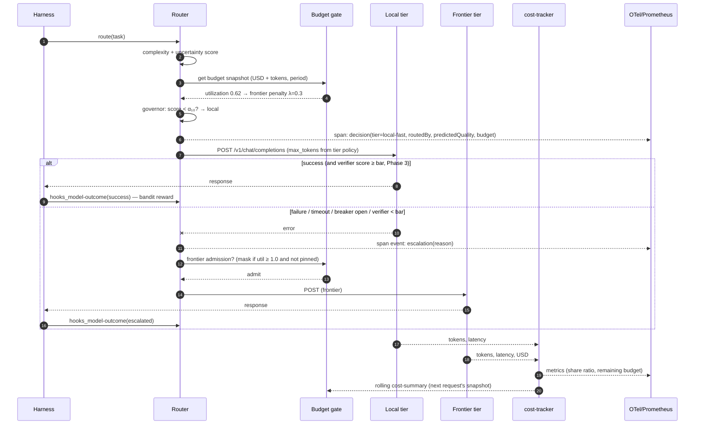
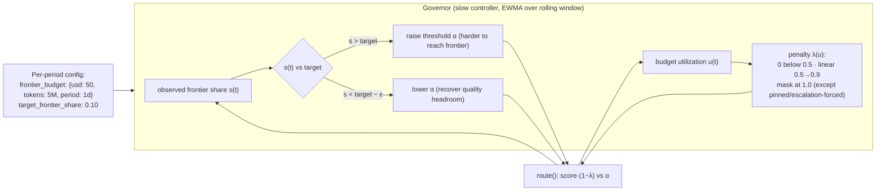
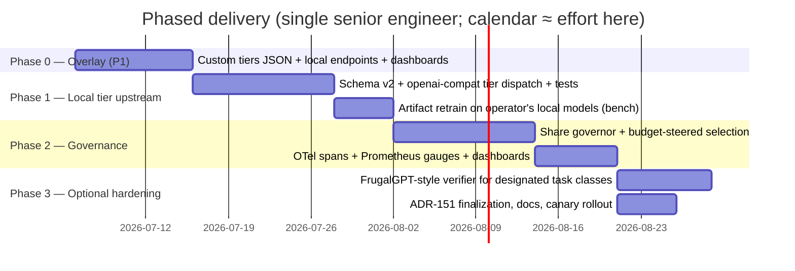

# RFC: Local-First Tiered Model Routing with Token Budgets and Observability for Ruflo

| | |
|---|---|
| **Status** | Draft for maintainer review (feature request supporting document) |
| **Audience** | `ruvnet/ruflo` maintainer + contributors; platform engineers evaluating adoption |
| **Date** | 2026-07-01 |
| **Repos audited** | `ruvnet/ruflo` @ `4eb807a` (2026-07-01) · `ruvnet/ruvector` @ `2b68dad` (2026-06-29) |
| **Companion doc** | `02-EVIDENCE-APPENDIX.md` (code-level evidence, env-var inventory, benchmark data, citations) |

---

## 1. Executive Summary

**Ask.** Extend Ruflo's routing stack so that a configurable majority of agent LLM traffic (target: ~90%) is served by **local open-weight models** (Ollama / vLLM / llama.cpp endpoints), with a governed **~10% fall-through to frontier models** (Claude, GPT, Gemini) for the hardest requests — enforced by **token/cost budgets that feed back into routing decisions**, and made auditable through **first-class observability** (OpenTelemetry GenAI spans + Prometheus metrics).

**Finding.** After a code-level audit of both repositories, roughly **70–80% of the required machinery already exists** in ruflo/ruvector, but it is distributed across three partially-connected subsystems (the CLI's heuristic+bandit router, the gated neural router, and the providers/integration packages) and is **Anthropic-tier-shaped** (haiku/sonnet/opus) rather than **locality-shaped** (local/frontier). The three specific gaps are:

1. **No first-class local tier** — Ollama is a global provider *substitution*, not a rung the router can select per-request.
2. **No traffic-share governance** — nothing enforces or even targets a 90/10 split; the ratio is an emergent side effect of the complexity distribution.
3. **Budgets alert but do not steer** — rich cost tracking and a 50/75/90/100% alert ladder exist, yet remaining budget is never an input to `route()`.

**Recommendation (preview).** Of five evaluated paths, we recommend **Path 2 — "Upstream Extension": evolve ruflo's existing TypeScript router into a locality-aware, budget-governed router**, shipped in three phases, with **Path 1 (config-only overlay) as a zero-risk Phase 0** available today, and **Path 4 (ruvector-Rust sidecar gateway) documented as the performance-driven evolution** if request volume ever justifies it. Full scoring in §6–7.

---

## 2. Goals and Non-Goals

### 2.1 Goals

| # | Goal | Measurable target |
|---|------|-------------------|
| G1 | Local-first delegation | ≥ 90% of routed requests (rolling 7-day) served by local open-weight endpoints; ≤ 10% by frontier APIs |
| G2 | Quality preservation | Escalation path guarantees hard tasks reach frontier models; task success rate within 3 pp of an all-frontier baseline on the repo's own bench corpus |
| G3 | Token/cost budgets that steer | Frontier spend is a governed resource: per-period USD **and** token budgets; budget pressure demotes routing decisions *before* hard-stop |
| G4 | Fall-through reliability | Ordered fallback local → local-alt → frontier on failure/timeout, with per-tier circuit breakers (already partially present) |
| G5 | Observability | Every routing decision emits provenance (`routedBy`, tier, provider, predicted quality, budget snapshot); OTel GenAI-conformant spans; Prometheus metrics incl. remaining-budget and tier-share gauges |
| G6 | Learning loop preserved | Thompson bandit + outcome recording (`hooks_model-outcome`) continues to work across the new tier vocabulary |

### 2.2 Non-Goals

- Replacing Claude Code / Codex as the harness (ruflo's identity is "the harness"; this RFC only concerns the model-selection layer beneath it).
- Building or hosting inference itself — local serving remains Ollama/vLLM/llama.cpp, consumed over their OpenAI-compatible APIs.
- Semantic caching, prompt compression, or speculative decoding (valuable, orthogonal; noted in §10 as future work).

---

## 3. Current-State Analysis (What Exists vs. What Is Missing)

> Full file-by-file evidence with paths and line references is in **`02-EVIDENCE-APPENDIX.md` §A**. This section is the condensed decision-relevant view.

### 3.1 Building blocks that already exist

| Capability | Where (repo · path) | Maturity |
|---|---|---|
| 3-tier routing (T1 $0 codemod → Haiku → Sonnet/Opus) | ruflo · `v3/@claude-flow/cli/src/ruvector/model-router.ts` (~1,490 LoC) + ADR-026/143 | **Shipped, default-on** |
| Online learning (Thompson-sampling Beta-Bernoulli bandit, complexity-bucketed priors, persisted state) | same module; state in `.swarm/model-router-state.json` | **Shipped** |
| Escalation + per-tier circuit breaker + uncertainty quantification | same module | **Shipped** |
| Cost-optimal neural routing (k-NN / KRR / FastGRNN), quality bar, **latency budget**, **cost ceiling ($/MTok)**, isotonic calibration, ensemble disagreement | ruflo · `neural-router.ts` (ADR-148/149/150), artifacts in `assets/model-router/` | **Shipped, gated** (`CLAUDE_FLOW_ROUTER_NEURAL=1`) |
| Per-tier alternate-model catalog with *measured* cost/quality/latency benchmarks | ruflo · `assets/model-router/openrouter-alts.json` (+ judge-bias audit) | **Shipped** |
| Multi-provider dispatch: Anthropic, OpenRouter, **Ollama (cloud or `localhost:11434`)** | ruflo · `mcp-tools/agent-execute-core.ts` (`OLLAMA_BASE_URL`, `RUFLO_PROVIDER`) | **Shipped** |
| Provider abstraction: Anthropic/OpenAI/Google/Cohere/Ollama + failover + cost/latency load balancing | ruflo · `@claude-flow/providers` (ProviderManager) | **Built, partially wired** |
| Budget config w/ period + warning/exceeded events | ruflo · `@claude-flow/integration/multi-model-router.ts` | **Built, parallel stack** |
| Cost telemetry: per-session token capture, USD attribution per agent/model/tier, 50/75/90/100% alert ladder w/ hard stop, burn-rate, MAD anomaly, counterfactual vs always-X baselines, **Prometheus textfile + webhook export** | ruflo · `plugins/ruflo-cost-tracker` (20+ skills, 23 CLI subcommands) | **Shipped (plugin)** |
| Routing provenance (`routedBy` on every decision, never inferred) + trajectory & parallel-decision recorders | ruflo · `neural-router.ts`, `router-trajectory.ts`, `router-parallel-recorder.ts` | **Shipped** |
| µs-scale neural routing inference engine (FastGRNN, ~7.5 µs/inference, <1 MB models, conformal prediction, circuit breaker) | ruvector · `crates/ruvector-tiny-dancer-core` (+node/wasm bindings) | **Shipped (crate)** |
| Vector DB + routing engine (HNSW, SIMD, quantization) usable for semantic route caching | ruvector · `crates/ruvector-router-core` | **Shipped (crate)** |

### 3.2 The three gaps (restated precisely)

**Gap 1 — Tier vocabulary is provider-shaped, not locality-shaped.**
`ClaudeModel = 'haiku' | 'sonnet' | 'opus' | …` and the execution provider hint is `'anthropic' | 'openrouter'`. The alts mechanism (`CLAUDE_FLOW_ROUTER_OPENROUTER_ALTS`) can *re-point* a tier at a different hosted model, and `OLLAMA_BASE_URL` + `RUFLO_PROVIDER=ollama` can swap the *entire* execution path to a local daemon — but no configuration expresses "tier `fast` = local Qwen at `http://localhost:11434/v1`, tier `frontier` = Claude Opus", selectable *per request* by the router.

**Gap 2 — No traffic-share target.**
The bandit's reward shaping (Haiku-success 1.0 > Sonnet-success 0.7 > Opus-success 0.4) biases toward cheap tiers, and `CLAUDE_FLOW_ROUTER_COST_CEILING_USD_PER_MTOK` can *exclude* expensive candidates outright — but neither mechanism can express or converge on "frontier handles ≈10% of traffic." RouteLLM's threshold-calibration result (choose the routing threshold α to hit a target strong-model call rate) is the missing primitive [R1].

**Gap 3 — Budget is observed, not consumed.**
`cost-budget-check` can exit 1 on hard stop and `multi-model-router` emits `budget:warning`/`budget:exceeded`, yet `route()` never reads remaining budget. The stable machine-readable contract already exists (`cost-summary --format json`); it simply isn't plumbed into selection. LiteLLM demonstrates the target semantics: per-provider `max_budget` + `budget_duration`, requests over budget rejected/redirected, and a Prometheus `litellm_provider_remaining_budget_metric` gauge [L1][L2].

### 3.3 Architecture as-is (observed)



*Green = the local path exists but is all-or-nothing (Gap 1). Amber = cost data flows out to dashboards but never back into routing (Gap 3).*

---

## 4. Research and Industry Grounding

Four bodies of prior art directly inform the design and validate feasibility of the 90/10 target:

**RouteLLM (Ong et al., ICLR 2025, arXiv:2406.18665)** — trains routers on preference data to choose between a strong and weak model per query. Reports **>2× cost reduction without quality loss**, up to **85% cost reduction on MT-Bench**, and — critically for G1 — formalizes the exact control we need: a routing threshold calibrated against a **target strong-model call rate**, with metrics (APGR, CPT) for how much of the strong model's quality is recovered at a given call budget. Routers also **transfer across model pairs without retraining**, supporting our plan to reuse ruflo's shipped KRR/FastGRNN artifacts against new local models as a warm start [R1].

**FrugalGPT (Chen, Zaharia & Zou, 2023, arXiv:2305.05176)** — the cascade pattern: try cheap model, score the answer with a learned post-query quality estimator, escalate only on low score. Matched the best single LLM at **up to 98% lower cost**, and in its case study sent **only 16.6% of queries to GPT-4** — empirical proof that a ~10–17% frontier share is attainable on real workloads [R2]. Ruflo currently escalates *pre-response* (uncertainty-driven) and learns *post-hoc*; FrugalGPT's *in-band verify-then-escalate* is the missing third mechanism, proposed here as an optional Phase-3 verifier.

**LiteLLM proxy (BerriAI)** — the reference implementation for the budget semantics we want: per-provider/per-model `max_budget` with `budget_duration` (1s…1mo), fail-closed budget enforcement, ordered + context-window fallbacks, routing strategies (usage-based, latency-based), Prometheus metrics including remaining-budget gauges, and an OTel callback [L1][L2][L3]. We treat LiteLLM both as **Path 3** (adopt it outright) and as a **semantics benchmark** for Paths 1–2.

**OpenTelemetry GenAI semantic conventions** — the emerging standard (status: Development) for LLM telemetry: `gen_ai.*` span attributes for operation, provider, request/response models, and `gen_ai.usage.input_tokens` / `gen_ai.usage.output_tokens`, plus agent spans and metrics [O1][O2]. Adopting these names (instead of inventing ruflo-specific ones) makes routing telemetry consumable by Grafana/Datadog/Jaeger without adapters — Claude Code itself already exports OTel metrics/logs [O3].

**Local serving substrate** — Ollama exposes an OpenAI-compatible endpoint at `localhost:11434/v1` suitable for single-user/dev; vLLM offers the same API shape with roughly **2× Ollama's throughput at 32-way concurrency** for team/production loads; llama.cpp's `llama-server` covers minimal-footprint cases. Migration between them is a base-URL + model-name change, which is why the proposal keys the local tier on *any OpenAI-compatible base URL* rather than on Ollama specifically [S1][S2].

---
## 5. Five Candidate Paths

All effort figures assume **one senior engineer familiar with TypeScript/Rust**, expressed in person-weeks (pw), and include tests + docs to the repo's existing ADR standard. Confidence intervals reflect audit-observed codebase volatility (the repo is large and fast-moving; several ADRs document earlier doc/code drift, e.g. ADR-026's correction note and ADR-073 "stub tool honesty").

### Path 1 — Config-Only Overlay (no upstream code change)

**Idea.** Exploit existing override points: publish a *custom* alternates JSON via `CLAUDE_FLOW_ROUTER_OPENROUTER_ALTS` whose "cheap" tiers point at local models; where a per-tier local provider is needed, interpose a thin OpenAI-compatible shim (LiteLLM in passthrough mode, or Ollama's native `/v1`) so the existing `openrouter`-shaped dispatch happens to hit `localhost`. Enforce budgets operationally with the cost-tracker's hard-stop ladder + cron'd `cost-export --prometheus`.

- **Delivers:** partial G1 (local-by-substitution), G4 (existing fallback), G5-lite (Prometheus textfiles), G6.
- **Cannot deliver:** true per-request tier locality (Gap 1 remains — provider hint is still `anthropic|openrouter`), share governance (Gap 2), budget-steered routing (Gap 3). The 90/10 ratio is achieved only by *hand-tuning complexity thresholds* and hoping the traffic distribution holds.
- **Effort:** **1–2 pw** (config authoring, shim deployment, dashboard).
- **Risk:** Low technically; **moderate correctness risk** — masquerading local endpoints as "openrouter" pollutes provenance labels and the bandit's per-model priors.

### Path 2 — Upstream Extension of the TypeScript Router («Locality-Aware Ruflo»)

**Idea.** Evolve the shipped router in place, in the ADR lineage the repo already uses (this would be ~ADR-151+):

1. **Tier schema v2** — generalize `openrouter-alts.json` into `routing-tiers.json`: each tier entry gains `provider: 'anthropic'|'openrouter'|'openai-compat'`, `base_url`, and `locality: 'local'|'frontier'`. `agent-execute-core` grows one dispatch branch (the OpenAI-compat call **already exists** — `callOllamaCompat` — it just isn't tier-addressable).
2. **Share governor** — a RouteLLM-style calibrated threshold on the complexity/quality score, adjusted by a slow controller so the rolling frontier share converges on the configured target (default 0.10); escalations always bypass the governor (quality floor beats quota).
3. **Budget-steered selection** — `route()` reads the cost-tracker's `cost-summary` JSON (already a stable contract) and applies a demotion penalty to frontier candidates as utilization crosses the existing 50/75/90 rungs; at 100% the frontier tier is masked except for explicitly pinned requests. Token budgets ride the same mechanism (`tokens_per_period` alongside `usd_per_period`).
4. **Observability** — emit OTel GenAI spans (`gen_ai.*` + `ruflo.route.*` extension attrs) at the decision point and provider call; extend the cost-tracker Prometheus exporter with `ruflo_tier_share_ratio`, `ruflo_frontier_budget_remaining_{usd,tokens}`, `ruflo_route_decisions_total{tier,provider,routed_by}`.
5. **Artifact retrain** — run the repo's existing bench harness against the operator's local endpoints to regenerate DRACO rows and the KRR artifact (the alts file itself instructs exactly this).

- **Delivers:** G1–G6 fully.
- **Effort:** **6–9 pw** (schema+dispatch 1.5; governor 1–2; budget feedback 1–1.5; OTel+metrics 1–1.5; retrain+bench 1; hardening/ADR/tests 1–1.5).
- **Risk:** Moderate — touches the hot routing path (mitigated by the repo's own double-gating idiom and `routedBy` provenance discipline); requires maintainer buy-in (hence this document).

### Path 3 — Adopt an Off-the-Shelf Gateway (LiteLLM-class) Under Ruflo

**Idea.** Ruflo keeps deciding *tier*; a LiteLLM (or Bifrost-class) proxy owns *providers, budgets, fallbacks, metrics*. Ruflo's provider hint becomes "send tier-X to gateway alias X"; the gateway maps aliases to Ollama/vLLM/Anthropic/OpenAI/Gemini with `max_budget`+`budget_duration`, fail-closed enforcement, and Prometheus/OTel out of the box [L1][L2][L3].

- **Delivers:** G3, G4, G5 immediately and battle-tested; G1 partially (locality lives in gateway config, invisible to the router — the bandit learns per-alias, which mostly suffices).
- **Cannot deliver cleanly:** G2 (no traffic-share targeting in gateway routing strategies — budgets cap spend, they don't shape the ratio); learning-loop attribution gets one hop blurrier; two config planes to keep coherent.
- **Effort:** **2–4 pw** integration (+ ongoing ops: the proxy wants Postgres/Redis at production scale; Python-proxy overhead is documented to bite past a few hundred RPS — likely irrelevant at agent-harness volumes) [L3][L4].
- **Risk:** Low technically; **strategic risk** of split-brain configuration and a permanent external dependency in the critical path.

### Path 4 — Rust Sidecar Gateway Assembled from ruvector Crates

**Idea.** Promote `ruvector-tiny-dancer-core` (FastGRNN routing, ~7.5 µs inference, circuit breaker, conformal uncertainty) + `ruvector-router-core` (HNSW/SIMD — semantic route-cache) into a standalone **`ruvector-gateway`**: an axum/tokio OpenAI-compatible reverse proxy that embeds the neural router, budget ledger, and OTel exporter natively. Ruflo (and anything else) consumes it as `base_url`.

- **Delivers:** G1–G5 with the best latency/footprint profile in the field (native inference in-process; no Node cold-start; single static binary). Serves the broader ruvector ecosystem, not just ruflo.
- **Costs:** re-implements provider adapters, streaming/tool-call translation, budget persistence, and the learning-loop bridge back to ruflo's bandit; splits routing brain across two runtimes during transition.
- **Effort:** **10–16 pw** (proxy skeleton + provider adapters 3–4; router embed + artifact loading 2–3; budget ledger + governor 2–3; OTel/metrics 1–2; ruflo integration + outcome bridge 2–3; hardening 1–2).
- **Risk:** Moderate-high scope risk; high reward. Natural **phase-2 evolution** of Path 2 rather than a competitor to it — the governor/budget semantics designed in Path 2 port directly.

### Path 5 — Clean-Room Rust Implementation (greenfield gateway, no reuse)

**Idea.** Build the routing gateway from scratch in Rust: own router (train FastGRNN or logistic scorer), own provider layer, own budget/observability stack.

- **Delivers:** maximal control; zero inherited debt.
- **Costs:** duplicates ruvector's already-published crates *and* the LiteLLM/Bifrost feature surface (provider adapters, streaming, tool-translation, retries, budgets, dashboards) — a competitive market where mature Go/Python incumbents claim µs–ms overheads already [L4]. Forfeits ruflo's learning loop, bench corpus, and measured alternates data unless re-bridged (which converges back to Path 4 at higher cost).
- **Effort:** **20–28+ pw** to reach feature parity worth shipping; ongoing maintenance of a full gateway product.
- **Risk:** High — classic NIH trap; opportunity cost dwarfs any performance delta over Path 4, which reuses the same Rust inference core.

### 5.1 Path capability × effort summary

| | P1 Config overlay | P2 Upstream ext. | P3 Gateway adopt | P4 Rust sidecar (ruvector) | P5 Clean-room Rust |
|---|---|---|---|---|---|
| G1 Local tier, per-request | ◐ substitution only | ● | ◐ via aliases | ● | ● |
| G2 90/10 share governance | ○ manual tuning | ● | ○ | ● | ● |
| G3 Budget-steered routing | ○ hard-stop only | ● | ◐ caps, not steering | ● | ● |
| G4 Fall-through + breakers | ◐ | ● | ● | ● | ● |
| G5 OTel + Prometheus | ◐ textfile | ● | ● | ● | ● |
| G6 Learning loop intact | ◐ label pollution | ● | ◐ | ◐ bridge needed | ○ rebuild |
| **Effort (pw)** | **1–2** | **6–9** | **2–4** | **10–16** | **20–28+** |
| Upstreamable as ruflo feature | n/a | **Yes (ADR-151)** | Partially (docs) | Yes (ruvector) | No |

● full · ◐ partial · ○ absent

---

## 6. Decision Criteria and Weighted Scoring

Criteria and weights were chosen to reflect (a) the stated product goal (90/10 + budgets + observability dominate), (b) the audience of this document (an upstream feature request — maintainability and upstreamability matter), and (c) proportionality (agent-harness traffic volumes make raw gateway latency a minor criterion). Scores are 1–5, assigned from §5's analysis.

| Criterion (weight) | Rationale | P1 | P2 | P3 | P4 | P5 |
|---|---|--:|--:|--:|--:|--:|
| **Goal fit: G1–G3 achievable in full** (0.25) | The point of the exercise | 2 | 5 | 4 | 5 | 5 |
| **Time-to-value** (0.20) | 90% of savings deferred is savings lost | 5 | 3 | 4 | 2 | 1 |
| **Operational risk** (0.15) | New moving parts, config planes, failure modes | 4 | 3 | 3 | 2 | 1 |
| **Maintainability / upstreamability** (0.15) | Survives repo velocity; benefits the whole community | 3 | 5 | 3 | 4 | 2 |
| **Runtime performance overhead** (0.10) | Router hot-path + proxy hop cost | 4 | 4 | 2 | 5 | 5 |
| **Observability depth** (0.10) | Decision provenance → dashboards, OTel conformance | 3 | 5 | 4 | 4 | 4 |
| **Reversibility / lock-in** (0.05) | Cost of backing out | 5 | 3 | 4 | 2 | 1 |
| **Weighted total** | | **3.50** | **4.10** | **3.50** | **3.55** | **2.85** |

Worked example (P2): 5(.25)+3(.20)+3(.15)+5(.15)+4(.10)+5(.10)+3(.05) = 1.25+0.60+0.45+0.75+0.40+0.50+0.15 = **4.10**.

**Sensitivity.** P2 remains first under every single-criterion ±0.05 weight perturbation. P4 overtakes P2 only if performance-overhead weight triples (>0.30) — i.e., only in a high-QPS serving context that an agent harness does not occupy today. P3 ties P1 as the best "this week" option but plateaus at G2.

## 7. Recommendation

**Primary: Path 2**, staged as **P1 → P2 → (optional) P4**:

- **Phase 0 (now, P1):** ship the config overlay to start capturing savings and — more importantly — to start *collecting the outcome data* the retrained artifact and governor calibration need.
- **Phases 1–3 (the feature request, P2):** land tier schema v2, the share governor, budget-steered selection, and OTel/Prometheus surfaces upstream as an ADR-governed feature.
- **Documented evolution (P4):** if/when routing volume or multi-tenant use justifies a standalone gateway, the P2 semantics port onto ruvector's Rust crates; nothing in P2 forecloses this.

**Why P2 over the runner-ups.** P3 (gateway) wins on day-one budget enforcement but structurally cannot express the 90/10 share target and bifurcates the learning loop that is ruflo's core differentiator; it remains an excellent *complement* for orgs that already run LiteLLM. P4 maximizes goal fit and performance but at 2× the effort and with a runtime split, for latency headroom the workload doesn't need yet. P1 is not an endpoint — it degrades provenance labels the bandit depends on. P5 fails on opportunity cost against a mature gateway market and ruvector's own published crates.


---

## 8. Proposed Architecture (Path 2 in Detail)

### 8.1 Target component architecture



*Blue = new components. Green = local tiers. Everything else already exists and is reused unmodified or lightly extended.*

### 8.2 Request lifecycle (sequence)



### 8.3 Budget-steering control loop



Design notes: **quality floor beats quota** — uncertainty-triggered escalations and circuit-breaker fall-through always pass the governor (they *count against* share and budget, pulling α up afterwards, but a hard task is never knowingly under-served); the FrugalGPT verifier (Phase 3, optional) converts "hope local was right" into "checked local was right" for designated task classes [R2].

### 8.4 Schema: `routing-tiers.json` v2 (superset of `openrouter-alts.json`)

```jsonc
{
  "_meta": { "schema_version": 2, "supersedes": "openrouter-alts.json v1" },
  "policy": {
    "target_frontier_share": 0.10,
    "share_window": "7d",
    "frontier_budget": { "usd_per_period": 50, "tokens_per_period": 5000000, "period": "1d" },
    "demotion_rungs": [0.5, 0.75, 0.9, 1.0]        // reuses cost-tracker ladder
  },
  "tiers": {
    "codemod":     { "locality": "local",    "provider": "none" },
    "local-fast":  { "locality": "local",    "provider": "openai-compat",
                     "base_url": "http://localhost:11434/v1",
                     "model": "qwen2.5-coder:7b",
                     "max_tokens": 2048, "cost_per_m_tok_in": 0, "cost_per_m_tok_out": 0 },
    "local-heavy": { "locality": "local",    "provider": "openai-compat",
                     "base_url": "http://gpubox:8000/v1",
                     "model": "Qwen/Qwen2.5-Coder-32B-Instruct",
                     "max_tokens": 8192 },
    "frontier":    { "locality": "frontier", "provider": "anthropic",
                     "model": "claude-opus-4-8", "max_tokens": 16384,
                     "alternates": ["openai/gpt-4.1", "google/gemini-2.5-pro"] }
  },
  "tier_map_compat": { "haiku": "local-fast", "sonnet": "local-heavy", "opus": "frontier" }
}
```

`tier_map_compat` preserves the bandit's persisted per-bucket priors and every consumer that still speaks haiku/sonnet/opus — the same back-compat idiom ADR-149 already used for `modelId`.

### 8.5 Observability specification

**Spans** (OTel GenAI conventions [O1][O2], plus a namespaced extension):

| Attribute | Source |
|---|---|
| `gen_ai.operation.name`, `gen_ai.provider.name`, `gen_ai.request.model`, `gen_ai.response.model` | provider call |
| `gen_ai.usage.input_tokens`, `gen_ai.usage.output_tokens` | provider response |
| `ruflo.route.tier`, `ruflo.route.locality`, `ruflo.route.routed_by` | decision (`routedBy` already exists and is never inferred — keep that discipline) |
| `ruflo.route.predicted_quality`, `ruflo.route.complexity_bucket` | scorer |
| `ruflo.route.frontier_share_rolling`, `ruflo.route.budget_utilization` | governor snapshot |
| span event `ruflo.route.escalation` `{reason: breaker\|uncertainty\|verifier\|failure}` | fall-through |

**Prometheus** (extends the cost-tracker exporter; mirrors LiteLLM's remaining-budget gauge pattern [L2]):
`ruflo_route_decisions_total{tier,provider,routed_by}` · `ruflo_escalations_total{reason}` · `ruflo_tier_share_ratio{locality}` · `ruflo_frontier_budget_remaining_usd` · `ruflo_frontier_budget_remaining_tokens` · `ruflo_route_decision_duration_seconds` (histogram).

**Acceptance dashboards:** (1) share-vs-target with governor α overlay; (2) budget burn-down vs period; (3) escalation Pareto by reason; (4) quality drift — bandit success rate per tier vs the counterfactual baselines the cost-tracker already computes.

### 8.6 Delivery plan



**Acceptance criteria (exit of Phase 2):** on the repo's own bench corpus + 2 weeks of live traffic — (a) frontier share within 10%±2pp rolling-7d; (b) zero budget hard-stops reached without ≥2 prior demotion rungs observed in metrics; (c) task success within 3pp of all-frontier baseline (`cost-counterfactual` provides the harness); (d) every decision carries `routedBy` + budget snapshot in spans; (e) p95 added routing latency < 5 ms (heuristic path) / < 25 ms (neural path incl. embedding).

## 9. Risks and Mitigations

| Risk | Likelihood | Impact | Mitigation |
|---|---|---|---|
| Local-model quality below expectations on operator's real tasks | Med | High | Phase 0 collects real outcomes before governance tightens; verifier (Phase 3); quality-floor-beats-quota invariant; `cost-counterfactual` regression gate in CI |
| Repo velocity / merge conflicts (large, fast-moving codebase) | High | Med | ADR-first process the repo already follows; double-gated rollout idiom (`…_ROUTER_LOCALITY=1`) mirroring ADR-148; small PR series |
| Bandit prior pollution across tier renames | Med | Med | `tier_map_compat` keeps prior keys stable; schema-versioned state file (v3 → v4) with migration, as done for ADR-142/149 |
| Governor oscillation (share hunting around target) | Low | Low | slow EWMA controller, hysteresis band ε, per-day α step cap |
| Budget snapshot staleness (file-based cost-summary) | Med | Low | in-process cache + session-end flush already exists (Stop hook); acceptable for daily budgets; Redis backend noted as P4 follow-on |
| Maintainer declines upstream | Med | Med | Phase 0 works unforked; Phase 1–2 can live as a plugin using the existing hooks/env override points, at ~+30% effort |

## 10. Out of Scope / Future Work

Semantic route caching on `ruvector-router-core` HNSW (skip inference for near-duplicate prompts); prompt-adaptation cost lever from FrugalGPT [R2]; multi-tenant budget hierarchies (LiteLLM tag-budget analogue [L2]); Path 4 gateway extraction once volume justifies it.

## 11. Open Questions for the Maintainer

1. Is `routing-tiers.json` v2 acceptable as a superset of `openrouter-alts.json`, or is a separate file preferred to keep ADR-148 artifacts immutable?
2. Should the share governor live in `model-router.ts` (heuristic path, always on) or only behind the neural gate?
3. Preference on OTel dependency weight in the CLI package (full SDK vs. minimal span emission to an OTLP endpoint)?
4. Is the cost-tracker plugin's `cost-summary` JSON contract stable enough to be promoted to a core interface, or should the budget gate read AgentDB directly?
5. Appetite for a `ruvector-gateway` crate (Path 4) as a ruvector-side roadmap item referencing this design?

---

## References

**Repository evidence** (full inventory in `02-EVIDENCE-APPENDIX.md`): ruflo @ `4eb807a`, ruvector @ `2b68dad` — file paths cited inline throughout.

- **[R1]** Ong, I. et al. *RouteLLM: Learning to Route LLMs with Preference Data.* ICLR 2025. arXiv:2406.18665. https://arxiv.org/abs/2406.18665 — threshold-calibrated strong/weak routing; >2× cost reduction; up to 85% on MT-Bench; cross-pair transfer. (See also LMSYS release notes: https://www.lmsys.org/blog/2024-07-01-routellm/)
- **[R2]** Chen, L., Zaharia, M., Zou, J. *FrugalGPT: How to Use Large Language Models While Reducing Cost and Improving Performance.* 2023. arXiv:2305.05176. https://arxiv.org/abs/2305.05176 — cascade + post-query quality scorer; up to 98% cost reduction; case study routed 16.6% of queries to GPT-4.
- **[L1]** LiteLLM docs — *Budget Routing* (per-provider `max_budget`, `budget_duration`, remaining-budget Prometheus gauge): https://docs.litellm.ai/docs/proxy/provider_budget_routing
- **[L2]** LiteLLM docs — *Prometheus metrics* (token/spend/budget metric groups): https://docs.litellm.ai/docs/proxy/prometheus
- **[L3]** LiteLLM docs — *Config settings & reliability* (fallbacks, cooldowns, routing strategies, `fail_closed_budget_enforcement`, OTel callback): https://docs.litellm.ai/docs/proxy/config_settings · https://docs.litellm.ai/docs/proxy/reliability
- **[L4]** Gateway landscape surveys (2026) noting Python-proxy throughput limits and Go/Rust-class alternatives: https://www.getmaxim.ai/articles/top-5-ai-gateways-for-optimizing-llm-cost-in-2026/
- **[O1]** OpenTelemetry — *Semantic conventions for generative AI spans* (status: Development): https://opentelemetry.io/docs/specs/semconv/gen-ai/gen-ai-spans/
- **[O2]** OpenTelemetry — GenAI attribute registry (`gen_ai.provider.name`, `gen_ai.usage.*`): https://opentelemetry.io/docs/specs/semconv/registry/attributes/gen-ai/
- **[O3]** OpenTelemetry blog — *Inside the LLM Call: GenAI Observability* (Claude Code / Codex OTel export): https://opentelemetry.io/blog/2026/genai-observability/
- **[S1]** Ollama OpenAI-compatible endpoint at `localhost:11434/v1`; migration guidance Ollama↔vLLM: https://www.sitepoint.com/ollama-to-vllm-migration-guide-teams/
- **[S2]** Ollama vs vLLM throughput comparison (≈2× at 32-way concurrency, same API shape): https://www.spheron.network/blog/ollama-vs-vllm/
