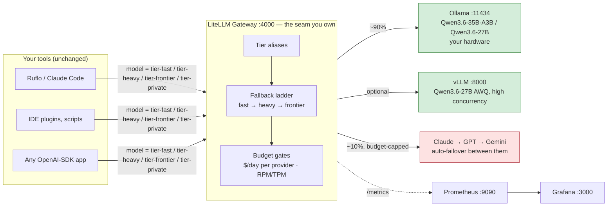
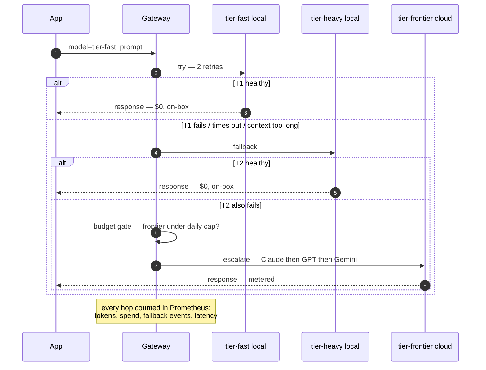

# Local-First Tiered LLM Routing — The Power User's Guide

**What this is:** a complete, self-hosted stack that sends ~90% of your LLM traffic to open-weight models running on *your* hardware and reserves ~10% (the genuinely hard requests) for frontier APIs (Claude / GPT / Gemini) — with fall-through reliability, hard budget caps, a privacy-pinned lane that can never leave your machine, and Grafana dashboards for all of it.

**Who it's for:** a single power user or small team who values **privacy, performance, quality, and availability**, has a machine capable of local inference, and wants everything configurable in plain YAML/JSON — no vendor lock-in, no code changes to your tools.

**Files in this kit:**

| File | Purpose |
|---|---|
| `GUIDE.md` | This document |
| `docker-compose.yml` | One-command stack: Ollama, LiteLLM gateway, Postgres, Prometheus, Grafana (+ optional vLLM, RouteLLM profiles) |
| `.env.example` | Copy to `.env`; keys and endpoints |
| `config/gateways/litellm-config.yaml` | **The heart of the system** — tier aliases, fallback chains, budgets, metrics |
| `config/observability/prometheus.yml` / `config/observability/grafana-datasources.yml` | Observability wiring |
| `config/routing/ruflo-tiers.json` | Drop-in tier map for Ruflo/Claude-Flow users (§8.1) |
| `smoke-test.sh` | Verifies every tier, the fall-through ladder, the privacy pin, and metrics |
| `config/gateways/routellm.Dockerfile` | Builds the optional learned-router service |

---

## 1. The Big Picture



The core idea: **every tool you own points at one URL** (`http://localhost:4000/v1`) and asks for a *tier* instead of a model. What actually serves each tier — which local model, which frontier provider, in what fallback order, under what budget — is your YAML. Change your mind, edit one file, restart one container.

---

## 2. Prerequisites

### 2.1 Hardware (pick your tier-2 ambition)

| Your machine | Realistic local tiers | Notes |
|---|---|---|
| 16 GB RAM, no GPU / small GPU | tier-fast = a 7–14B **dense** coder (Q4) only | The 35B-A3B MoE below needs ~20+ GB and won't fit; skip tier-heavy locally and let its fallback go straight to frontier |
| 24–32 GB RAM or 12–16 GB VRAM | tier-fast = `Qwen3.6-35B-A3B` (MoE, ~3B active) at Q4; no local tier-heavy | The MoE fits in ~20 GB and runs at dense-7B speed; a dense 27B tier-heavy wants more room, so fall its heavy tier through to frontier |
| Apple Silicon 32–64 GB unified | tier-fast = `Qwen3.6-35B-A3B` (MoE) · tier-heavy = `Qwen3.6-27B` (dense) | **Run Ollama natively on the host** (Docker has no Apple-GPU access) — see §3, step 2; prefer the MLX builds (`qwen3.6:35b-mlx`, `qwen3.6:27b-mlx`) |
| NVIDIA 24 GB+ (3090/4090/5090…) | tier-fast = `Qwen3.6-35B-A3B` (or lighter `Qwen3-Coder-30B-A3B`) · tier-heavy = `Qwen3.6-27B`-AWQ on vLLM | Dense 27B at Q4/AWQ is ~16–17 GB weights + KV — fits 24 GB for moderate context; enable the `gpu` profile for ~2× throughput at concurrency |

> **Model selection is current as of the June–July 2026 open-weight leaderboards** (SWE-bench Verified). The prior `qwen2.5-coder:7b/32b` pair is now two generations behind — see §2.4a for the evidence, footprints, licenses, and the frontier-class open models that top the boards but do **not** fit single-box hardware.

### 2.2 Software (install links)

| Component | Link | Needed for |
|---|---|---|
| Docker Engine / Desktop + Compose v2 | https://docs.docker.com/get-docker/ | Everything |
| NVIDIA Container Toolkit | https://docs.nvidia.com/datacenter/cloud-native/container-toolkit/latest/install-guide.html | Only for GPU-in-Docker (Ollama-GPU or vLLM) |
| Ollama (native install, macOS/Windows) | https://ollama.com/download | Only if not running Ollama in Docker |
| Git (to keep this kit versioned) | https://git-scm.com/downloads | Recommended |

### 2.3 Accounts / keys (any subset — all optional)

- Anthropic: https://console.anthropic.com/ → API key
- OpenAI: https://platform.openai.com/api-keys
- Google Gemini: https://aistudio.google.com/apikey

No frontier keys at all? The stack still works — you just get a fully-local, zero-escalation system (leave the keys blank; frontier tier calls will fail over to nothing and error, or delete the frontier entries).

### 2.4 Model sources

- Ollama model library (GGUF, one-command pull): https://ollama.com/library — recommended starters (2026): `qwen3.6:35b-a3b-q4_K_M` (tier-fast), `qwen3.6:27b` (tier-heavy). See §2.4a for why these replace the older `qwen2.5-coder` builds.
- Hugging Face (safetensors, for vLLM): https://huggingface.co/models — e.g. `Qwen/Qwen3.6-27B`, `Qwen/Qwen3.6-35B-A3B`, `Qwen/Qwen3-Coder-30B-A3B-Instruct`

### 2.4a Which models, and why (open-weight landscape, June–July 2026)

The tiers are just aliases (§4.1), so the model behind each is a one-line change. But the *default* choice matters, and the open-weight field moved two generations past `qwen2.5-coder` in the year since. This selection is anchored to **SWE-bench Verified** (the most-cited agentic-coding benchmark) cross-checked across the July 2026 leaderboards. **Caveat up front:** these scores are largely vendor-reported and scaffolding-dependent (e.g. the 30B-A3B figure uses OpenHands 100-turn), so treat cross-model gaps under ~3 pp as noise, and re-verify on *your* tasks with the §9 harness.

**Fits local hardware (what to actually run):**

| Role | Model | Params (active) | License | SWE-bench Verified | Q4 footprint | Fit |
|---|---|---|---|--:|---|---|
| **tier-fast (default)** | Qwen3.6-35B-A3B | 35B MoE (~3B active) | Apache-2.0 | **73.4%** | ~20 GB | 32 GB+ RAM / 24 GB GPU; runs at ~3B-dense speed. **Now on Ollama** as `qwen3.6:35b-a3b-q4_K_M` (`qwen3.6:35b-mlx` on Apple Silicon). |
| **tier-fast (lighter alt)** | Qwen3-Coder-30B-A3B | 30.5B MoE (3.3B active) | Apache-2.0 | 51.6% | ~19–22 GB | Coding-specialized, slightly smaller — for tighter machines. On Ollama as `qwen3-coder:30b-a3b-q4_K_M`. |
| **tier-heavy (default)** | Qwen3.6-27B (dense) | 27–28B dense | Apache-2.0 | **77.2%** | ~16–17 GB | 24 GB GPU / 64 GB Mac. Direct upgrade from `qwen2.5-coder:32b`; beats last-gen's 397B model on coding. |
| **tier-heavy (fallback)** | Qwen3.5-27B (dense) | 27B dense | Apache-2.0 | 72.4% | ~16–17 GB | Same footprint; use if a 3.6 build misbehaves. |

**Emerging candidate worth piloting — Ornith-1.0 (DeepReinforce, MIT, released Jun 25 2026).** A self-scaffolding agentic-coding family RL-post-trained on top of Gemma 4 / Qwen 3.5 bases (both Apache-2.0, so the MIT release is license-clean). It's directly relevant here because it's *purpose-built for tool-use/multi-turn agents* — the exact §12.2 weakness that generic coders are worst at. Two variants fit local hardware:

| Role | Model | Params (active) | License | SWE-bench Verified † | Q4/Q5 footprint | Fit |
|---|---|---|---|--:|---|---|
| tier-fast / **16 GB & edge** | Ornith-1.0-9B (dense) | 9B dense | MIT | 69.4% † | ~6 GB Q4 | Fills the 16 GB rung the table above lacks — *if the number holds*. |
| tier-fast (agentic) | Ornith-1.0-35B MoE | 35B MoE (~3B active) | MIT | 75.6% † | ~20 GB Q4 / ~25 GB Q5 | Competes with Qwen3.6-35B-A3B (73.4); agentic-tuned. |

† **These are vendor-reported ("DeepReinforce official evaluation"), not yet on an independent SWE-bench Verified leaderboard.** A 9B dense at 69.4 would be extraordinary and is unconfirmed — treat with more skepticism than the Qwen rows above. *Supporting evidence:* official GGUF weights on HF (`deepreinforce-ai/Ornith-1.0-35B-GGUF` ~285k downloads / 645 likes; `-9B-GGUF` ~255k dl), reputable `bartowski` quants, runs on Ollama (`ollama run hf.co/deepreinforce-ai/Ornith-1.0-35B-GGUF`) / LM Studio / vLLM / llama.cpp, and hands-on praise from Simon Willison, who ran the 35B Q4_K_M locally: *"it seems to be able to run the agent harness over many tool calls in a proficient way"* (~103 tok/s). *Against:* DeepReinforce has little public track record (Willison: "I couldn't find much information about DeepReinforce themselves"), and the model is ~1 week old. **Verdict:** pilot the **35B MoE** as an alternative tier-fast (side-by-side vs Qwen3.6-35B-A3B on *your* agentic tasks via the §9 harness) and the **9B** for 16 GB machines — but keep the verified Qwen entries as the default until an independent SWE-bench run confirms these numbers. Don't promote it to default on vendor benchmarks alone.

**Tops the boards but too big for a single box** — open-weight, but hundreds-of-billions-to-trillion-param MoE needing multi-GPU clusters (e.g. GLM-4.6 AWQ = 176 GB across 4×48 GB). Use these only as **hosted-API frontier alternates** (add them to the `tier-frontier` alias, §4.1), never as a local rung:

| Model | Params (active) | License | SWE-bench Verified |
|---|---|---|--:|
| DeepSeek V4 Pro | 1.6T MoE (49B active) | MIT | 80.6% |
| MiniMax M3 | ~230B+ MoE | open | 80.5% |
| Kimi K2.6 (Moonshot) | 1T MoE (32B active) | Modified MIT | 80.2% |
| DeepSeek V4 Flash | 284B MoE (13B active) | MIT | 79.0% |
| GLM-5 (Z.AI) | ~744B MoE (~40B active) | MIT | 77.8% |
| GLM-4.7 (Z.AI) | 355B MoE | MIT | 73.8% (LiveCodeBench 84.9) |

**On the two models originally flagged as unverifiable** — status corrected after a direct source check:
- **Ornith** (correct spelling; the first-pass research query carried an "Orinth" typo *and* the model was ~4 days old at sweep time, so it turned up empty): **it is real** — see the Ornith-1.0 candidate block above. Official MIT weights, real HF traction, independent hands-on testing. Its benchmarks remain vendor-reported pending independent confirmation, but "does not exist" was wrong.
- **Gemma 4**: still not pinned down as a *standalone* recommendation — the specific size/license claims in the first sweep were refuted. But note it is corroborated as a real **base model** (Apache-2.0) that Ornith-1.0 is partly built on. Revisit for direct use if an official Gemma 4 card confirms specs.

**Also unestablished (open questions, verify locally):** real tokens/sec for these models on M-series Apple Silicon and on a 24 GB NVIDIA GPU (throughput claims were refuted in research); their head-to-head **agentic tool-calling / BFCL-v3** ranks (two tool-calling leaderboard claims were refuted — SWE-bench is used here as the proxy, which §12 argues is exactly the signal a router must not ignore); and whether the dense `Qwen3.6-27B` holds a *usefully long* context on 24 GB at Q4 (plausible, not benchmarked). This space is moving fast — GLM-5.1/5.2, Qwen3.7-Max and DeepSeek "-Max" variants were already surfacing at this window, so re-check the leaderboards before a long-term pin.

---

## 3. Quick Start (10 minutes + model download time)

```bash
# 1. Put the kit files in a directory, then:
cp .env.example .env
$EDITOR .env                 # set LITELLM_MASTER_KEY + any frontier keys

# 2. Start the stack
docker compose up -d
#    macOS/Windows with native Ollama instead:
#    - in .env set  OLLAMA_API_BASE=http://host.docker.internal:11434
#    - then:        docker compose up -d --scale ollama=0

# 3. Pull the local models (first pull downloads several GB)
docker exec ollama ollama pull qwen3.6:35b-a3b-q4_K_M       # tier-fast (MoE, ~3B active, ~20GB) — on Ollama
docker exec ollama ollama pull qwen3.6:27b                   # tier-heavy (dense, ~17GB) — skip on small machines
#    (native Ollama: just `ollama pull …` on the host)

# 4. Verify everything
./smoke-test.sh

# 5. Point a tool at it — any OpenAI-compatible client:
export OPENAI_BASE_URL=http://localhost:4000/v1
export OPENAI_API_KEY=$LITELLM_MASTER_KEY
# …and request model "tier-fast" (or tier-heavy / tier-frontier / tier-private)
```

Dashboards: Grafana at http://localhost:3000 (admin / your `GRAFANA_PASSWORD`), Prometheus at http://localhost:9090, LiteLLM admin UI at http://localhost:4000/ui.

Optional profiles:

```bash
docker compose --profile gpu up -d       # adds vLLM on :8000 (NVIDIA only)
docker compose --profile router up -d    # adds RouteLLM learned router on :6060 (§7.3)
```

---

## 4. How It Works

### 4.1 Tiers are aliases; routing is config

`config/gateways/litellm-config.yaml` defines four **aliases**. Clients never name real models:

| Alias | Serves | Role |
|---|---|---|
| `tier-fast` | local MoE `Qwen3.6-35B-A3B` (Ollama) | Default workhorse — the "90%" |
| `tier-heavy` | local dense `Qwen3.6-27B` (Ollama, optionally + vLLM under the same alias) | Harder tasks that still stay on-box |
| `tier-frontier` | Claude Opus → GPT → Gemini (three deployments, one alias); optionally add hosted open-weight leaders (DeepSeek V4 / Kimi K2.6 / GLM-5, §2.4a) | The "10%": budget-capped, auto-failover between providers |
| `tier-private` | local dense `Qwen3.6-27B`, **no fallback chain** | Structurally cannot leave your machine |

### 4.2 The fall-through ladder



Three distinct safety nets stack here: **retries** (transient blips), **fallbacks** (a tier is down or the prompt overflows its context window — `context_window_fallbacks` up-shifts automatically), and **cooldowns** (a deployment failing repeatedly is benched for 30 s, LiteLLM's circuit-breaker analogue).

### 4.3 Budgets that actually block

Each frontier deployment carries `max_budget` + `budget_duration` (e.g. $3/day for Claude). When a deployment crosses its budget, the gateway stops sending to it for the rest of the period — and because `tier-frontier` has three deployments, exhausting Claude's budget fails over to GPT, then Gemini, then (only when all are exhausted) errors. Spend state lives in Postgres and survives restarts. Rate caps (`rpm`/`tpm`) sit alongside as burst protection — agentic tools can fire 10–20k-token requests in quick succession, and token-per-minute caps catch what request-per-minute caps miss.

### 4.4 Where the "90/10" comes from — two mechanisms, use either or both

**Mechanism A — structural (default in this kit):** your *client* decides the tier. Ruflo's complexity router, or your own habit of using `tier-fast` by default, produces the split; the gateway's ladder + budgets enforce the ceiling on frontier usage. Simple, transparent, zero extra latency. The ratio is emergent, governed by budget caps rather than targeted precisely.

**Mechanism B — learned (optional `router` profile):** the RouteLLM service (LMSYS's open-source framework from the ICLR 2025 paper) scores each prompt with a matrix-factorization router and picks strong-vs-weak per request. Its threshold is **calibrated to an explicit strong-model percentage** — this is the literal 90/10 dial:

```bash
# Inside the routellm container (or any Python env with routellm installed):
python -m routellm.calibrate_threshold --routers mf --strong-model-pct 0.1 \
       --config config.example.yaml
# → prints e.g.  "For 10.0% strong model calls for mf, threshold = 0.24034"
```

Clients then call the RouteLLM endpoint (`http://localhost:6060/v1`) with `model="router-mf-0.24034"`; it forwards to the gateway's `tier-frontier` or `tier-fast` accordingly, so budgets and metrics still apply downstream. Published results for this approach: >2× cost reduction without quality loss, up to 85% cost reduction on MT-Bench. Two caveats live in §11: calibration is against Chatbot Arena data (your true share will drift from the calibrated pct until you re-tune), and the default `mf` router calls OpenAI for embeddings — a privacy trade-off.

---

## 5. Understanding the Trade-offs (read this before tuning)

Every design choice here trades something. Knowing which lever trades what keeps tuning rational:

| Lever | You gain | You give up |
|---|---|---|
| Smaller tier-fast model (7B vs 14B) | Speed, RAM headroom, snappier feel | First-try success rate → more fallbacks (which cost latency, and money if they reach frontier) |
| Heavier quantization (Q4 vs Q8/FP16) | Fits bigger models in less memory | Subtle quality loss, worst on long reasoning and strict-format outputs |
| Tighter frontier budgets | Hard cost ceiling, forcing-function to improve local tiers | Hard tasks may land on an exhausted tier and degrade to local quality |
| Aggressive fallback ladder | Availability — something always answers | Silent quality substitution: you *got* an answer, but from a weaker model (watch the fallback metrics, §9) |
| RouteLLM learned routing | Precise, principled 90/10 dial | +1 hop latency, an embeddings dependency, calibration upkeep |
| Ollama (llama.cpp) serving | Dead-simple, GGUF everywhere | Mostly sequential — concurrency queues; vLLM gives ~2× throughput at 32-way concurrency but wants NVIDIA + safetensors |
| `turn_off_message_logging: true` | Prompt bodies never persisted by the gateway | Harder debugging; flip per-investigation, not permanently |

---

## 6. Configuration Deep Dive

### 6.1 `config/gateways/litellm-config.yaml` anatomy

- **`model_list`** — each entry is a *deployment*: an alias (`model_name`) plus what actually serves it (`litellm_params.model`, `api_base`, keys, budgets, rate caps). **Repeating an alias creates load-balancing + failover across its deployments** — that's how `tier-frontier` spans three providers and how `tier-heavy` can span Ollama + vLLM.
- **`litellm_settings.fallbacks`** — the ladder. Order matters; it's tried left-to-right. Note `tier-private` appears in no chain: that *absence* is the privacy guarantee.
- **`context_window_fallbacks`** — up-shift on long prompts *before* the small model truncates or errors (requires `enable_pre_call_checks: true`).
- **`router_settings.allowed_fails` / `cooldown_time`** — the breaker. 3 failures within a minute benches a deployment for 30 s.
- **`general_settings.database_url`** — Postgres; required for budgets/virtual keys to persist.

Full reference: https://docs.litellm.ai/docs/proxy/config_settings · fallbacks: https://docs.litellm.ai/docs/proxy/reliability · budgets: https://docs.litellm.ai/docs/proxy/provider_budget_routing

### 6.2 Common tuning recipes

**Swap the workhorse model** (one line):
```yaml
model: ollama_chat/qwen3.6:35b-a3b     # was qwen3-coder:30b-a3b-q4_K_M — stronger MoE, same ~3B-active speed
```
then `docker exec ollama ollama pull qwen3.6:35b-a3b && docker compose restart litellm`.

**Raise/lower the frontier ceiling:** edit `max_budget` per deployment. Skew the failover order by reordering deployments or setting asymmetric budgets (e.g. Claude $5/day as primary, others $1/day as emergency spares).

**No-GPU machine:** delete/comment the `tier-heavy` deployments, change fallbacks to `tier-fast: ["tier-frontier"]`.

**Per-tool budgets (virtual keys):** mint scoped keys so, e.g., your IDE agent gets its own daily cap independent of your scripts:
```bash
curl http://localhost:4000/key/generate -H "Authorization: Bearer $LITELLM_MASTER_KEY" \
  -H "Content-Type: application/json" \
  -d '{"key_alias":"ide-agent","max_budget":1.5,"budget_duration":"1d","models":["tier-fast","tier-heavy","tier-frontier"]}'
```
Give that key to the tool instead of the master key. (This is also the cleanest multi-user story.)

### 6.3 Tuning the 90/10 with RouteLLM (Mechanism B)

1. Start it: `docker compose --profile router up -d` (note: `mf` router needs `OPENAI_API_KEY` for embeddings even when both routed models are local).
2. Calibrate: run the `calibrate_threshold` command from §4.4 with `--strong-model-pct 0.1`.
3. Point clients at `http://localhost:6060/v1`, `model="router-mf-<threshold>"`.
4. **Re-calibrate against reality:** after a week, compute your *actual* frontier share from Prometheus (§9) and nudge the threshold — calibration data (Chatbot Arena) is not your traffic; treat the calibrated pct as a starting point, not a promise. Start conservative (5–15%) and inspect outputs before loosening.

RouteLLM repo (framework, pretrained `mf`/`bert`/`causal_llm` routers, calibration + eval tools): https://github.com/lm-sys/RouteLLM · Paper: https://arxiv.org/abs/2406.18665

---

## 7. Integrating Your Tools

### 7.1 Ruflo / Claude-Flow

Ruflo keeps its complexity scoring and bandit learning; the gateway serves the tiers:

```bash
export CLAUDE_FLOW_ROUTER_OPENROUTER_ALTS=$PWD/config/routing/ruflo-tiers.json   # ships in this kit
export OPENROUTER_API_KEY=$LITELLM_MASTER_KEY                     # any non-empty value
export OPENROUTER_BASE_URL=http://localhost:4000/v1               # if honored by your version
# Fallback wiring if your ruflo build routes OpenRouter traffic only to openrouter.ai:
export RUFLO_PROVIDER=ollama
export OLLAMA_BASE_URL=http://localhost:4000                      # gateway speaks /v1/chat/completions
export OLLAMA_API_KEY=$LITELLM_MASTER_KEY
```

Because ruflo's Ollama path is a plain OpenAI-compat client with a configurable base URL, pointing it at the gateway means even "ollama" traffic gains fallbacks, budgets, and metrics. Trade-off (from the companion RFC): ruflo's per-model bandit labels blur slightly, since it can't see which physical model the gateway chose.

### 7.2 Anything using the OpenAI SDK

```python
from openai import OpenAI
client = OpenAI(base_url="http://localhost:4000/v1", api_key="<your-virtual-key>")
resp = client.chat.completions.create(model="tier-fast", messages=[...])
print(resp.model)   # tells you which physical model actually served it
```

### 7.3 Sensitive work

Point it at `tier-private`. That alias has no fallback chain and a local-only deployment — a misconfigured budget or a dead local daemon produces an *error*, never a silent cloud escalation. Verify any time with the privacy-pin check in `smoke-test.sh`.

---

## 8. Observability: What to Watch

Prometheus scrapes the gateway's `/metrics` (open-source again since LiteLLM v1.80.0 — it was enterprise-gated between late-2024 and that release; if you pin an image from that window, metrics will be absent). Useful queries to build your Grafana panels around:

| Question | PromQL starting point |
|---|---|
| **Am I actually at 90/10?** | `sum(rate(litellm_input_tokens_metric[1d])) by (model)` → compare local vs frontier model shares |
| Frontier spend today | `sum(litellm_spend_metric) by (model)` (or the admin UI's spend page / `/spend` endpoints) |
| Fallbacks happening? (silent quality substitution) | deployment failure/success counters by model — alert on rising failure rate for tier-fast |
| Latency per tier | request-duration histograms by model → p50/p95 panels |
| Budget headroom | remaining-budget gauges (enable `prometheus_initialize_budget_metrics: true` to emit them even for idle keys) |

Metric reference: https://docs.litellm.ai/docs/proxy/prometheus. A community Grafana dashboard for LiteLLM exists if you'd rather import than build (search the Grafana dashboard registry for "LiteLLM").

**Weekly 10-minute review:** frontier share vs target → adjust threshold/budgets; fallback counts → is tier-fast under-powered?; spend trend → any runaway tool? (mint it a tighter virtual key).

---

## 9. Testing & Validation

`./smoke-test.sh` covers: each tier answers · forced fall-through (`mock_testing_fallbacks`) · **privacy pin** (asserts `tier-private` never resolves to a cloud model) · metrics endpoint live · spend query.

Beyond smoke tests:

- **Budget block drill:** temporarily set one frontier deployment's `max_budget: 0.000001`, restart, call `tier-frontier` twice — first call may pass, second must fail over to the next provider. Restore after.
- **Quality regression harness (recommended):** keep 15–30 prompts representative of *your* work in a file; run them through `tier-fast` and `tier-frontier` after any model swap and eyeball or LLM-judge the diff. (Ruflo users: the repo's `cost-benchmark` / `cost-counterfactual` skills do this with real math.)
- **Load sanity (if sharing the box):** fire 8–16 concurrent tier-fast requests; if latency collapses, that's Ollama's sequential nature — consider the vLLM profile.

---

## 10. Benefits — What You Get

- **Privacy by architecture:** ~90% of prompts never leave your hardware, and the `tier-private` lane makes "never" structural rather than behavioral. Gateway logging of message bodies is off by default in this kit.
- **Cost ceiling, not cost hope:** daily caps per provider that *block*, plus per-tool virtual-key budgets. Research context: cascade/routing systems have repeatedly shown 50–98% cost reductions at matched quality (FrugalGPT, arXiv:2305.05176; RouteLLM, arXiv:2406.18665).
- **Availability better than frontier-only:** provider outage or rate-limit ≠ stoppage; you degrade to local and keep working. Two local backends + three frontier providers = five independent serving paths.
- **One seam, total flexibility:** every tool speaks to one URL; models, ladders, budgets, and providers are YAML edits. Nothing here locks you in — the OpenAI-compatible seam means any component (Ollama→vLLM, LiteLLM→Bifrost, local→cloud) swaps independently.
- **Observability parity with SaaS gateways:** tokens, spend, latency, fallbacks per model in Grafana — on your box.

## 11. Limitations — What This Doesn't Solve (honest list)

> Items 1–3 below are inherent to the **guided approach**; §12 gives each a concrete, cited mitigation. This list stays honest about what the kit ships with *today*.

1. **Local model quality has a real ceiling.** A local coder — even a strong 27–35B-class one — will lose to frontier models on long-horizon reasoning, subtle instruction-following, and especially **agentic tool-calling**, where small models are documented to over-call, mis-select, and mishandle tool results (BFCL/τ-bench, §12.2). If your workload is tool-heavy, expect a higher-than-10% escalation share or accept quality loss.
2. **The 90/10 in Mechanism A is emergent, not enforced.** Budgets cap the damage but don't *shape* the ratio; only Mechanism B (RouteLLM) targets a percentage, and its calibration is against public data, so your realized share drifts until you re-tune against your own metrics.
3. **No response-quality verification in-band.** A fallback fires on *errors*, not on *bad answers*. A local model that confidently answers wrong is served. (Remedy: a small verifier that scores local outputs and re-asks frontier on low scores — the FrugalGPT pattern; ~100 lines, not included here.)
4. **RouteLLM's default router phones home for embeddings** (OpenAI), and its checkpoints were trained on an older model generation — rankings still transfer per the paper, but treat it as a heuristic, not ground truth.
5. **Ollama concurrency:** mostly sequential; multi-user or parallel-agent load queues. vLLM profile solves it at the cost of NVIDIA-only + more setup.
6. **Single-node, homelab-grade:** no HA, no multi-instance budget sync (that needs Redis), Postgres on the same box. Fine for a power user; not a company platform as-is.
7. **LiteLLM is a Python proxy:** adds single-digit-ms overhead and wants periodic patching; at hundreds of RPS it becomes the bottleneck — far beyond personal use, but it's the known scale ceiling.
8. **Quantization is not free:** Q4 GGUF weights trade measurable quality for memory; strict-format and long-context tasks feel it first. Prefer Q5/Q6 or AWQ when memory allows.
9. **Maintenance is on you:** model updates, image updates, key rotation, disk for model blobs (tens of GB), and the weekly metrics review in §9.

## 12. Strengthening the Guided Router (Weaknesses & Mitigations)

§11 lists what the *stack* doesn't solve. This section addresses a narrower, sharper question: the limits of the **guided approach** itself — where ruflo (or your client) decides the tier from a heuristic complexity/length score and the 90/10 split emerges structurally (Mechanism A, §4.4). Each weakness below is paired with a concrete mitigation and the evidence behind it. Numbers are quoted from primary sources; where a claim is an engineering synthesis rather than a published result, it is labelled as such.

### 12.1 The routing signal is weak — length/lexical complexity ≠ difficulty
A guided router that scores mostly surface features mis-ranks in both directions: a one-line "prove this invariant" is short-but-hard; a 4k-token file paste asking for a reformat is long-but-trivial. Learned routers consistently beat heuristic/feature baselines on the cost-quality Pareto frontier: **RouteLLM**'s matrix-factorization router reaches **95% of GPT-4 quality using only ~26% GPT-4 calls** (≈3.66× cost-saving on MT-Bench; "over 2×" is the conservative framing), and transfers across model pairs without retraining ([RouteLLM, Ong et al., ICLR 2025, arXiv:2406.18665](https://arxiv.org/abs/2406.18665)). **Hybrid LLM** cuts large-model calls by **up to 40% at no quality drop** by training the router to predict the small-vs-large *quality gap* rather than reading surface features ([Ding et al., Microsoft, ICLR 2024, arXiv:2404.14618](https://arxiv.org/abs/2404.14618)). Standardized comparison: [RouterBench, arXiv:2403.12031](https://arxiv.org/abs/2403.12031); inductive/GNN routing: [GraphRouter, arXiv:2410.03834](https://arxiv.org/abs/2410.03834). *(That "length alone is a poor proxy" is our synthesis of this learned-router evidence — there is no single benchmark whose headline is "length fails".)*

**Mitigate:** turn on ruflo's already-shipped **neural router** (`CLAUDE_FLOW_ROUTER_NEURAL=1`, k-NN/KRR/FastGRNN over embeddings) instead of the lexical path; add non-length features (stack traces, multi-file scope, "prove/design/refactor-across-files"); reuse `ruvector-router-core` HNSW as a **semantic route cache** so near-duplicate prompts skip re-scoring.

### 12.2 Small local models are specifically weak at agentic tool-calling
This is the failure mode a length-based router is *least* equipped to see, because tool-heavy turns aren't necessarily long. On **BFCL** the gap is not syntax but *stateful multi-step orchestration*: small models that pass single-turn calls collapse multi-turn (e.g. xLAM-2-3b ~55.6% multi-turn, Qwen3-1.7B ~16.9%, vs ~94% relevance detection) ([Berkeley Function-Calling Leaderboard, Patil et al., ICML 2025](https://proceedings.mlr.press/v267/patil25a.html); [BFCL v3 multi-turn](https://gorilla.cs.berkeley.edu/blogs/13_bfcl_v3_multi_turn.html)). Even frontier agents are unreliable here — **τ-bench** shows GPT-4o at only ~35% (airline) / ~61% (retail) pass@1, and a 90%-pass@1 model drops to ~57% at pass^8 ([Yao et al., Sierra, arXiv:2406.12045](https://arxiv.org/abs/2406.12045)); **τ²-bench** puts the airline ceiling around 70% ([arXiv:2506.07982](https://arxiv.org/abs/2506.07982)). *(Per-model BFCL numbers are from secondary compilations — confirm against the live leaderboard before quoting to 0.1%.)*

**Mitigate:** treat **"agentic tool-calling / multi-turn"** as a hard escalation signal independent of prompt length — set a per-agent-type tier floor so tool-driven turns start at tier-heavy or frontier. This is also why §2.4a leans on SWE-bench/agentic scores, not raw code-completion, when picking local models.

### 12.3 No in-band quality verification — fallback fires on errors, not wrong answers
The ladder (§4.2) escalates on *failure/timeout*, never on a confidently-wrong local answer. The cascade remedy: score the cheap answer, escalate only on low score. **FrugalGPT** matched the best single LLM at **up to 98% lower cost** (HEADLINES $33.1→$0.6 = 98.3%), or **+4% accuracy at equal cost** ([Chen, Zaharia & Zou, Stanford, arXiv:2305.05176](https://arxiv.org/abs/2305.05176)). But the verifier is itself an LLM-as-judge, which is **systematically biased**: position-bias robustness can **fall below 0.5** with 3–4 options, self-enhancement error runs **1.16–16.1%**, plus verbosity and sentiment effects ([Justice or Prejudice?, arXiv:2410.02736](https://arxiv.org/html/2410.02736v1); [position bias, arXiv:2406.07791](https://arxiv.org/abs/2406.07791); [self-preference, arXiv:2410.21819](https://arxiv.org/html/2410.21819v2); [survey, arXiv:2411.15594](https://arxiv.org/html/2411.15594v6)). Escalation is also decision-theoretically non-trivial — naive always-escalate-on-low-confidence isn't optimal ([arXiv:2605.06350](https://arxiv.org/pdf/2605.06350)).

**Mitigate:** add a FrugalGPT-style **verify-then-escalate** scorer on designated task classes, but make the judge **swap-averaged / rubric-anchored** (not a single raw score) and treat its output as noisy. Gate model swaps in CI with the §9 quality-regression harness (ruflo's `cost-counterfactual` provides the math).

### 12.4 Budget is observed, not consumed
A pure guided router doesn't read remaining budget; budgets only alert then hard-stop — so at exhaustion a genuinely hard task lands on a spent tier and silently degrades. **LiteLLM** demonstrates the target semantics: per-provider `provider_budget_config` (`budget_limit` + `time_period`), over-budget providers **skipped** with an **HTTP 429** when all are exhausted, and a `litellm_provider_remaining_budget_metric` gauge ([provider budget routing](https://docs.litellm.ai/docs/proxy/provider_budget_routing); [Prometheus metrics](https://docs.litellm.ai/docs/proxy/prometheus)). *(LiteLLM enforces budgets fail-closed via 429; confirm the exact enforcement flag/behavior against your LiteLLM version.)* Research is converging on **putting remaining budget into the routing state**: PILOT (contextual bandit, [arXiv:2508.21141](https://arxiv.org/html/2508.21141v1)), SeqRoute (budget-in-MDP, [arXiv:2605.25424](https://arxiv.org/pdf/2605.25424)), ParetoBandit (cost + latency-SLA dual, [arXiv:2604.00136](https://arxiv.org/pdf/2604.00136)).

**Mitigate:** feed the cost-tracker's `cost-summary --format json` into `route()`; apply a demotion penalty to frontier candidates across the 50/75/90 rungs, mask frontier at 100% except pinned/escalation-forced; keep LiteLLM's 429 enforcement as the fail-closed backstop. Track a **token** budget alongside USD.

### 12.5 The 90/10 is emergent, not governed
Nothing *targets* a share; it drifts with your workload. **RouteLLM ships the missing primitive** — `calibrate_threshold --strong-model-pct 0.1` finds the router-score cutoff that sends a target fraction to the strong model (e.g. threshold ≈ 0.24034 for the `mf` router) ([RouteLLM README](https://github.com/lm-sys/RouteLLM/blob/main/README.md)). Calibrate to a target **call-rate**, not an absolute score — the score distribution is dataset-dependent.

**Mitigate:** a share governor that adjusts the threshold α so rolling frontier share converges on the target, with **quality-floor-beats-quota** (uncertainty/breaker escalations always bypass it). Re-calibrate weekly against your Prometheus actuals (§8), since public calibration data isn't your traffic.

### 12.6 Governor stability, provenance, and cold-start
- **Oscillation:** smooth the observed share with an **EWMA** and add a hysteresis band before nudging α — standard adaptive-threshold control theory applied to RouteLLM's calibration (an engineering synthesis, [EWMA control charts, Nature Sci. Rep. 2025](https://www.nature.com/articles/s41598-025-09735-z)), not a cited LLM-routing result.
- **Label pollution:** don't masquerade local endpoints as `openrouter` — it blurs the bandit's per-model priors. Use an explicit tier schema (`locality`/`provider`/`base_url`) and echo `response.model` back into the outcome record so learning stays clean.
- **Cold-start / drift:** warm-start new local models from RouteLLM's cross-pair transfer + retrain the KRR artifact on your endpoints; run a Phase-0 overlay purely to collect outcomes before tightening governance.

### 12.7 Observability the mitigations depend on
All of the above are only tunable if every decision is instrumented. Adopt **OpenTelemetry GenAI semantic conventions** — `gen_ai.usage.input_tokens` / `output_tokens`, `gen_ai.request.model`, `gen_ai.provider.name` — so telemetry is consumable by Grafana/Datadog/Jaeger without adapters ([OTel GenAI attribute registry](https://opentelemetry.io/docs/specs/semconv/registry/attributes/gen-ai/)). *Status caveat:* these attributes are named and adopted (Datadog supports them) but still marked **Development** (experimental), so pin a version and opt in explicitly ([OTel GenAI observability, 2026](https://opentelemetry.io/blog/2026/genai-observability/)).

### 12.8 Priority order
| Priority | Move | Closes | Relative effort |
|---|---|---|---|
| **Now** | Enable the shipped neural router; add task-class/tool-calling escalation signal | 12.1, 12.2 | hours |
| **Now** | Quality-regression harness in CI (`cost-counterfactual`) | 12.3 (detection) | ~1 pw |
| **Next** | Budget-steered `route()` consuming `cost-summary` JSON | 12.4 | 1–1.5 pw |
| **Next** | Share governor (calibrated α + EWMA/hysteresis) | 12.5, 12.6 | 1–2 pw |
| **Then** | Explicit tier schema (clean locality/provenance) + OTel spans | 12.6, 12.7 | ~2 pw |
| **Optional** | FrugalGPT-style swap-averaged verifier on designated task classes | 12.3 (correction) | ~1 pw |

The two highest-leverage moves are the cheapest: **turn on the neural router you already ship** and **add quality detection** — budgets and error-based fallback structurally cannot catch a confidently-wrong local answer.

## 13. Alternatives Worth Knowing

| Tool | When to prefer it over this kit |
|---|---|
| **Bifrost** (Go, open-source, self-hosted) — https://github.com/maximhq/bifrost | You want µs-class gateway overhead, native OTel, and no Python/Postgres footprint |
| **OpenRouter** (managed) — https://openrouter.ai | You want one key for many *cloud* models with zero ops — but requests transit their SaaS (weaker privacy story, no local tier) |
| **Portkey / TrueFoundry / Kong AI** (managed/enterprise gateways) | Team governance, RBAC, compliance needs beyond homelab scope |
| **Open WebUI** — https://github.com/open-webui/open-webui | You mainly want a chat UI over Ollama, not programmatic routing (composes fine *behind* this gateway too) |
| **LM Studio** — https://lmstudio.ai | GUI-first local model evaluation before promoting a model into a tier |

## 14. Resource Links

**Core components:** LiteLLM https://github.com/BerriAI/litellm (docs https://docs.litellm.ai) · Ollama https://ollama.com (library https://ollama.com/library) · vLLM https://docs.vllm.ai · llama.cpp `llama-server` https://github.com/ggml-org/llama.cpp · RouteLLM https://github.com/lm-sys/RouteLLM · Prometheus https://prometheus.io · Grafana https://grafana.com

**Research — routing & cascades (§12):** RouteLLM (arXiv:2406.18665) https://arxiv.org/abs/2406.18665 · FrugalGPT (arXiv:2305.05176) https://arxiv.org/abs/2305.05176 · Hybrid LLM (arXiv:2404.14618) https://arxiv.org/abs/2404.14618 · RouterBench (arXiv:2403.12031) https://arxiv.org/abs/2403.12031 · GraphRouter (arXiv:2410.03834) https://arxiv.org/abs/2410.03834 · budget-aware routing: PILOT (arXiv:2508.21141), SeqRoute (arXiv:2605.25424), ParetoBandit (arXiv:2604.00136)

**Research — verifier / LLM-as-judge reliability (§12.3):** Justice or Prejudice (arXiv:2410.02736) · position bias (arXiv:2406.07791) · self-preference (arXiv:2410.21819) · survey (arXiv:2411.15594) · cascade decision theory (arXiv:2605.06350)

**Research — agentic tool-calling (§12.2):** Berkeley Function-Calling Leaderboard https://gorilla.cs.berkeley.edu/leaderboard.html (ICML 2025) · τ-bench (arXiv:2406.12045) · τ²-bench (arXiv:2506.07982)

**Standards & budgets:** OpenTelemetry GenAI attribute registry https://opentelemetry.io/docs/specs/semconv/registry/attributes/gen-ai/ · LiteLLM provider budget routing https://docs.litellm.ai/docs/proxy/provider_budget_routing · LiteLLM Prometheus metrics https://docs.litellm.ai/docs/proxy/prometheus

**Model leaderboards (§2.4a, verify before pinning):** SWE-bench Verified aggregations — llm-stats https://llm-stats.com/benchmarks/swe-bench-verified · Vellum https://www.vellum.ai/open-llm-leaderboard · benchlm https://benchlm.ai/benchmarks/sweVerified · Ollama registry https://ollama.com/library

**Companion documents (from the earlier analysis):** `01-ARCHITECTURE-PROPOSAL.md` (the upstream-ruflo RFC — five paths, decision matrix) and `02-EVIDENCE-APPENDIX.md` (code-level audit of ruflo/ruvector).

---

*Kit assembled 2026-07-01; model selection (§2.4a) and guided-router mitigations (§12) refreshed 2026-07-02 against the June–July 2026 open-weight leaderboards and current routing literature. Versions move fast in this ecosystem — when a config key misbehaves or a model is superseded, the linked docs/leaderboards are the source of truth over this guide.*
