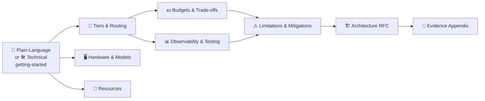

# 📖 Local-First Tiered LLM Routing — Guide

A self-hosted stack that sends **~90% of your LLM traffic to open-weight models on your own hardware** and reserves **~10%** for frontier APIs (Claude / GPT / Gemini) — with fall-through reliability, hard budget caps, a privacy-pinned lane that can never leave your machine, and Grafana dashboards for all of it.

> [!TIP]
> **Two front doors — pick the one that fits you.** Both lead into the same reference set below.

| Start here | If you are… |
|---|---|
| 🌱 **[Getting Started — Plain-Language](getting-started-nontechnical.md)** | New to this, non-technical, or briefing a stakeholder. Analogies, no jargon, careful copy-paste. |
| 🛠️ **[Getting Started — Technical](getting-started-technical.md)** | A developer or operator. Terminal, Docker, YAML — up and serving in ~10 minutes. |

---

## 📚 Reference set

Slim topic pages the two guides link into. Read them in any order.

| Page | What's inside |
|---|---|
| 🖥️ **[Hardware & Models](reference/hardware-and-models.md)** | What your machine can run; which open-weight models to pick, with evidence, footprints, licenses |
| 🧭 **[Tiers & Routing](reference/tiers-and-routing.md)** | The four tiers, the fall-through ladder, where the 90/10 split comes from, integrating your tools |
| 💵 **[Budgets & Trade-offs](reference/budgets-and-tradeoffs.md)** | The trade-off matrix, config anatomy, tuning recipes, per-tool spending caps |
| 📊 **[Observability & Testing](reference/observability.md)** | What to watch, PromQL panels, the weekly review, smoke tests + validation drills |
| 🔀 **[Gateway Variants](reference/gateway-variants.md)** | The pluggable gateway selector — litellm (default) / bifrost / helicone, one at a time, how to switch |
| ⚠️ **[Limitations & Mitigations](reference/limitations-and-mitigations.md)** | Honest list of what this doesn't solve — each guided-router weakness with a cited fix + priority order |
| 🔗 **[Resources & Alternatives](reference/resources.md)** | When to prefer another tool; all external links, papers, standards, leaderboards |

---

## 🏗️ Deeper background

| Page | What's inside |
|---|---|
| **[Architecture RFC](reference/architecture-rfc.md)** | Why this design — five candidate paths, weighted decision matrix, the recommended locality-aware, budget-governed architecture |
| **[Evidence Appendix](reference/evidence-appendix.md)** | Code-level audit of ruflo / ruvector — what already exists, the gap-traceability matrix |

---

## 🗺️ At a glance

> [!NOTE]
> This guide set is **self-contained** — every link points within it. Model selection and routing literature reflect the **June–July 2026** landscape; versions move fast, so the linked upstream docs and leaderboards in [Resources](reference/resources.md) are the source of truth over any snapshot here.
