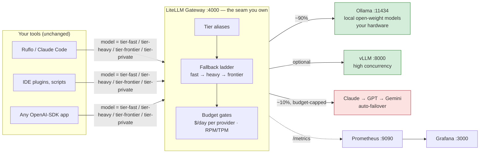

# 🛠️ Getting Started — Technical (Dev / Ops)

> **Audience:** developers and operators comfortable with a terminal, Docker, and YAML.
> **Goal:** stand up the local-first tiered LLM routing stack and serve your tools from one URL.
> **Time:** ⏱️ ~10 min hands-on + model download.

A self-hosted stack that sends **~90% of your LLM traffic to open-weight models on *your* hardware** and reserves **~10%** (the genuinely hard requests) for frontier APIs (Claude / GPT / Gemini) — with fall-through reliability, hard budget caps, a privacy-pinned lane that can never leave your machine, and Grafana dashboards for all of it.

> [!NOTE]
> This page is the **fast path**. Depth lives in the [reference set](README.md) — each step links to it. Read this to *ship*; read the reference to *tune*.

> **Before you start:** run through [Prerequisites](reference/prerequisites.md) (Docker, Ollama, keys — the Required tier). Then, optionally: **strengthen the guided router** (§1–§4 — neural routing, tool-calling escalation, quality verification, budget-steering → [Limitations & Mitigations](reference/limitations-and-mitigations.md#-strengthening-the-guided-router)) and **swap the gateway** (LiteLLM default · Bifrost · Helicone → [Gateway Variants](reference/gateway-variants.md)).

---

## 🧭 The whole idea in one picture



**Every tool points at one URL** (`http://localhost:4000/v1`) and asks for a *tier* instead of a model. What serves each tier — which local model, which frontier provider, in what fallback order, under what budget — is your YAML. Change your mind, edit one file, restart one container.

📖 Deep dive: [Tiers & Routing](reference/tiers-and-routing.md).

---

## ✅ Step 0 — Preflight

- [ ] **Docker Engine / Desktop + Compose v2** installed
- [ ] A machine that fits your target tiers (RAM / VRAM)
- [ ] *(Optional)* API keys for any frontier providers you want to escalate to

> [!IMPORTANT]
> **Pick your local models against your hardware *before* pulling anything.** The default `tier-fast` MoE needs ~19–22 GB; a dense `tier-heavy` wants ~16–17 GB more. On a small box, skip local `tier-heavy` and let it fall through to frontier.
>
> 🖥️ Hardware matrix + which models & why (SWE-bench Verified, footprints, licenses) → **[Hardware & Models](reference/hardware-and-models.md)**.

**Software you'll need:**

| Component | Link | Needed for |
|---|---|---|
| Docker Engine / Desktop + Compose v2 | https://docs.docker.com/get-docker/ | Everything |
| NVIDIA Container Toolkit | https://docs.nvidia.com/datacenter/cloud-native/container-toolkit/latest/install-guide.html | GPU-in-Docker (vLLM / Ollama-GPU) |
| Ollama (native, macOS/Windows) | https://ollama.com/download | Only if not running Ollama in Docker |

**Keys — any subset, all optional:** [Anthropic](https://console.anthropic.com/) · [OpenAI](https://platform.openai.com/api-keys) · [Google Gemini](https://aistudio.google.com/apikey). No keys at all still works — you get a fully-local, zero-escalation system.

---

## 🚀 Step 1 — Bring up the stack

```bash
cp .env.example .env
$EDITOR .env                 # set LITELLM_MASTER_KEY + any frontier keys
docker compose up -d
```

> [!TIP]
> **Apple Silicon / native Ollama?** Docker has no Apple-GPU access — run Ollama on the host:
> ```bash
> # in .env:  OLLAMA_API_BASE=http://host.docker.internal:11434
> docker compose up -d --scale ollama=0
> ```

## 📥 Step 2 — Pull local models

```bash
docker exec ollama ollama pull qwen3-coder:30b-a3b   # tier-fast (MoE ~3B active, ~19 GB)
docker exec ollama ollama pull qwen3.6:27b           # tier-heavy (dense ~16–17 GB) — verify tag; skip on small boxes
# native Ollama: just `ollama pull …` on the host
```

📖 Model choices and upgrades → [Hardware & Models](reference/hardware-and-models.md).

## 🔍 Step 3 — Verify

```bash
./smoke-test.sh
```

Covers: every tier answers · forced fall-through · **privacy pin** (asserts `tier-private` never resolves to cloud) · `/metrics` live · spend query. Detail → [Observability & Testing](reference/observability.md).

## 🔌 Step 4 — Point a tool at it

```bash
export OPENAI_BASE_URL=http://localhost:4000/v1
export OPENAI_API_KEY=$LITELLM_MASTER_KEY
# …request model "tier-fast" (or tier-heavy / tier-frontier / tier-private)
```

```python
from openai import OpenAI
client = OpenAI(base_url="http://localhost:4000/v1", api_key="<virtual-key>")
resp = client.chat.completions.create(model="tier-fast", messages=[...])
print(resp.model)   # which physical model actually served it
```

🧩 **Ruflo / Claude-Flow** keeps its complexity scoring + bandit learning; the gateway serves the tiers. Wiring → [Tiers & Routing → Integrating tools](reference/tiers-and-routing.md#-integrating-your-tools).

## 📊 Step 5 — Watch it

Grafana → http://localhost:3000 · Prometheus → http://localhost:9090 · LiteLLM UI → http://localhost:4000/ui

The one query that matters — *am I actually at 90/10?*
```promql
sum(rate(litellm_input_tokens_metric[1d])) by (model)
```
📈 Panel starter-pack + weekly 10-min review → [Observability & Testing](reference/observability.md).

---

## 🎛️ Where to go next

| I want to… | Go to |
|---|---|
| Understand the fall-through ladder (retries → fallbacks → cooldowns) | [Tiers & Routing](reference/tiers-and-routing.md#-the-fall-through-ladder) |
| Set budgets that actually **block** + per-tool virtual keys | [Budgets & Trade-offs](reference/budgets-and-tradeoffs.md) |
| Swap the workhorse model / no-GPU recipe | [Budgets & Trade-offs → Tuning recipes](reference/budgets-and-tradeoffs.md#-common-tuning-recipes) |
| Target a precise 90/10 with a learned router (RouteLLM) | [Tiers & Routing → The 90/10 dial](reference/tiers-and-routing.md#-where-the-9010-comes-from) |
| Know exactly what I'm trading away | [Budgets & Trade-offs → The trade-off matrix](reference/budgets-and-tradeoffs.md#-the-trade-off-matrix) |

> [!WARNING]
> Two limits to internalize before trusting the stack blindly:
> 1. **Fallbacks fire on *errors*, not *wrong answers*** — a confidently-wrong local answer is served as-is.
> 2. **Small local models are specifically weak at agentic tool-calling** — length-based routing can't see it.
>
> Full honest list + concrete, cited mitigations → **[Limitations & Mitigations](reference/limitations-and-mitigations.md)** (start with the priority table).

---

## 📚 Deeper background

- 🏗️ **Why this architecture** — five candidate paths, decision matrix, recommendation → [Architecture RFC](reference/architecture-rfc.md)
- 🔬 **What already exists in the codebase** — code-level audit, gap-traceability matrix → [Evidence Appendix](reference/evidence-appendix.md)
- 🧰 **Alternatives & all external links** → [Resources](reference/resources.md)

🙋 New to all this, or briefing a non-technical stakeholder? → [Getting Started — Non-Technical](getting-started-nontechnical.md).
