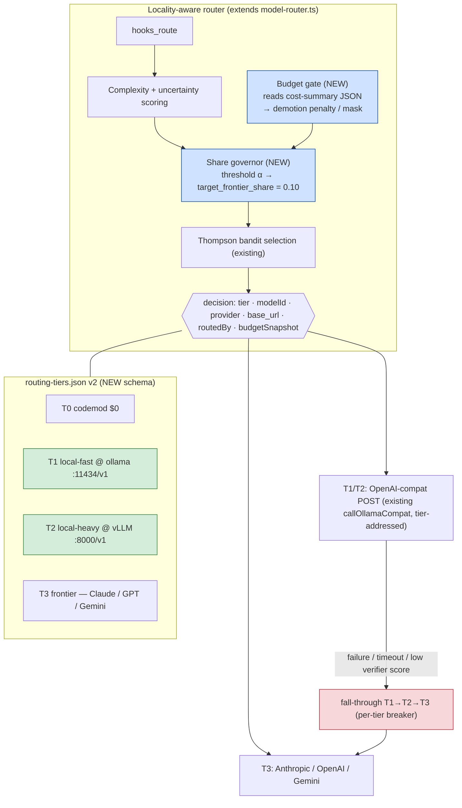

# 🏗️ Architecture RFC — Local-First Tiered Model Routing

> **What this is:** a reconditioned copy of the design RFC behind this kit — five candidate paths, a weighted decision matrix, and the recommended architecture for making ruflo locality-aware and budget-governed.
> **Companion:** code-level evidence in the [Evidence Appendix](evidence-appendix.md).

← Back to [Guide home](../README.md) · [Technical Guide](../getting-started-technical.md)

| | |
|---|---|
| **Status** | Draft for maintainer review (feature-request supporting document) |
| **Audience** | `ruvnet/ruflo` maintainer + contributors; platform engineers evaluating adoption |
| **Date** | 2026-07-01 |
| **Repos audited** | `ruvnet/ruflo` @ `4eb807a` (2026-07-01) · `ruvnet/ruvector` @ `2b68dad` (2026-06-29) |

---

## 1. Executive summary

**Ask.** Extend Ruflo's routing stack so a configurable majority of agent LLM traffic (target ~90%) is served by **local open-weight models** (Ollama / vLLM / llama.cpp), with a governed **~10% fall-through to frontier models** (Claude, GPT, Gemini) for the hardest requests — enforced by **token/cost budgets that feed back into routing decisions**, and made auditable through **first-class observability** (OpenTelemetry GenAI spans + Prometheus metrics).

**Finding.** After a code-level audit, roughly **70–80% of the required machinery already exists** in ruflo/ruvector, but it is distributed across three partially-connected subsystems (the CLI's heuristic+bandit router, the gated neural router, the providers/integration packages) and is **Anthropic-tier-shaped** (haiku/sonnet/opus) rather than **locality-shaped** (local/frontier). The three specific gaps:

1. **No first-class local tier** — Ollama is a global provider *substitution*, not a rung the router can select per-request.
2. **No traffic-share governance** — nothing enforces or even targets a 90/10 split; the ratio is an emergent side effect of the complexity distribution.
3. **Budgets alert but do not steer** — rich cost tracking and a 50/75/90/100% alert ladder exist, yet remaining budget is never an input to `route()`.

**Recommendation (preview).** Of five evaluated paths, recommend **Path 2 — "Upstream Extension": evolve ruflo's TypeScript router into a locality-aware, budget-governed router**, shipped in three phases, with **Path 1 (config-only overlay) as a zero-risk Phase 0** available today, and **Path 4 (ruvector-Rust sidecar gateway) documented as the performance-driven evolution** if request volume ever justifies it.

---

## 2. Goals and non-goals

### 2.1 Goals

| # | Goal | Measurable target |
|---|------|-------------------|
| G1 | Local-first delegation | ≥ 90% of routed requests (rolling 7-day) served locally; ≤ 10% by frontier APIs |
| G2 | Quality preservation | Escalation guarantees hard tasks reach frontier; success rate within 3 pp of an all-frontier baseline |
| G3 | Token/cost budgets that steer | Per-period USD **and** token budgets; budget pressure demotes routing decisions *before* hard-stop |
| G4 | Fall-through reliability | Ordered fallback local → local-alt → frontier on failure/timeout, with per-tier circuit breakers |
| G5 | Observability | Every decision emits provenance (`routedBy`, tier, provider, predicted quality, budget snapshot); OTel GenAI spans; Prometheus metrics |
| G6 | Learning loop preserved | Thompson bandit + outcome recording continues across the new tier vocabulary |

### 2.2 Non-goals
- Replacing Claude Code / Codex as the harness — this concerns only the model-selection layer beneath it.
- Building or hosting inference itself — local serving remains Ollama/vLLM/llama.cpp over OpenAI-compatible APIs.
- Semantic caching, prompt compression, speculative decoding (valuable, orthogonal; future work).

---

## 3. Current-state analysis

> Full file-by-file evidence with paths and line references is in the [Evidence Appendix §A](evidence-appendix.md#a-routing-subsystem-inventory-ruflo). This is the condensed decision-relevant view.

### 3.1 Building blocks that already exist (highlights)

- 3-tier routing (T1 $0 codemod → Haiku → Sonnet/Opus) — **shipped, default-on** (`model-router.ts`, ~1,490 LoC).
- Online learning (Thompson-sampling Beta-Bernoulli bandit, complexity-bucketed priors, persisted state) — **shipped**.
- Cost-optimal neural routing (k-NN / KRR / FastGRNN), quality bar, latency budget, cost ceiling, isotonic calibration — **shipped, gated** (`CLAUDE_FLOW_ROUTER_NEURAL=1`).
- Multi-provider dispatch incl. **Ollama** (`OLLAMA_BASE_URL`, `RUFLO_PROVIDER`) — **shipped**.
- Cost telemetry: per-session token capture, USD attribution, 50/75/90/100% alert ladder w/ hard stop, Prometheus textfile + webhook export — **shipped (plugin)**.
- µs-scale FastGRNN inference engine + HNSW vector DB for semantic route caching — **shipped (ruvector crates)**.

### 3.2 The three gaps (restated precisely)

- **Gap 1 — Tier vocabulary is provider-shaped, not locality-shaped.** No configuration expresses "tier `fast` = local Qwen at `localhost:11434/v1`, tier `frontier` = Claude Opus", selectable *per request*.
- **Gap 2 — No traffic-share target.** Reward shaping biases toward cheap tiers and a cost ceiling can *exclude* expensive candidates, but neither can converge on "frontier handles ≈10%." RouteLLM's threshold calibration is the missing primitive.
- **Gap 3 — Budget is observed, not consumed.** The machine-readable contract exists (`cost-summary --format json`); it simply isn't plumbed into selection. LiteLLM demonstrates the target semantics (per-provider `max_budget` + `budget_duration`, over-budget redirect, remaining-budget gauge).

---

## 4. Research grounding

Four bodies of prior art inform the design and validate feasibility of the 90/10 target:

- **RouteLLM (Ong et al., ICLR 2025, arXiv:2406.18665)** — routers trained on preference data; **>2× cost reduction without quality loss**, up to **85% on MT-Bench**; formalizes a threshold calibrated to a **target strong-model call rate**; transfers across model pairs without retraining.
- **FrugalGPT (Chen, Zaharia & Zou, 2023, arXiv:2305.05176)** — cascade: try cheap, score the answer, escalate on low score. Matched the best single LLM at **up to 98% lower cost**; a case study reportedly routed **only ~16.6% of queries to GPT-4** — proof a ~10–17% frontier share is attainable. (The 98% is in the paper's abstract; the ~16.6% routing-share figure is from its case study.)
- **LiteLLM proxy (BerriAI)** — reference implementation for the budget semantics: per-provider/model `max_budget` + `budget_duration`, fail-closed enforcement, ordered + context-window fallbacks, Prometheus remaining-budget gauge, OTel callback.
- **OpenTelemetry GenAI semantic conventions** — `gen_ai.*` span attributes; adopting these makes routing telemetry consumable by Grafana/Datadog/Jaeger without adapters.

---

## 5. Five candidate paths

All effort in person-weeks (pw), one senior TS/Rust engineer, incl. tests + docs.

- **Path 1 — Config-only overlay.** Point the existing alts JSON at local models; interpose an OpenAI-compat shim; enforce budgets operationally. **Delivers** partial G1, G4, G5-lite, G6. **Cannot** deliver per-request locality, share governance, or budget-steered routing. **1–2 pw.** Low technical risk, moderate correctness risk (label pollution).
- **Path 2 — Upstream extension («Locality-Aware Ruflo»).** Tier schema v2 (`provider`/`base_url`/`locality`), a RouteLLM-style share governor, budget-steered selection reading `cost-summary` JSON, OTel spans + new Prometheus gauges, artifact retrain. **Delivers G1–G6 fully. 6–9 pw.** Moderate risk (touches hot path).
- **Path 3 — Adopt an off-the-shelf gateway (LiteLLM-class).** Ruflo decides tier; the gateway owns providers/budgets/fallbacks/metrics. **Delivers G3–G5 immediately**; G1 partial (locality invisible to router); **cannot** cleanly deliver G2. **2–4 pw** + ongoing ops. Strategic risk of split-brain config.
- **Path 4 — Rust sidecar gateway from ruvector crates.** Promote the FastGRNN router + HNSW cache into a standalone `ruvector-gateway`. **Best latency/footprint; G1–G5. 10–16 pw.** Natural phase-2 evolution of Path 2.
- **Path 5 — Clean-room Rust.** Greenfield gateway, no reuse. **Maximal control, zero inherited debt** but **20–28+ pw** and duplicates ruvector + the mature gateway market. High NIH risk.

### 5.1 Capability × effort summary

| | P1 | P2 | P3 | P4 | P5 |
|---|---|---|---|---|---|
| G1 Local tier, per-request | ◐ | ● | ◐ | ● | ● |
| G2 90/10 governance | ○ | ● | ○ | ● | ● |
| G3 Budget-steered routing | ○ | ● | ◐ | ● | ● |
| G4 Fall-through + breakers | ◐ | ● | ● | ● | ● |
| G5 OTel + Prometheus | ◐ | ● | ● | ● | ● |
| G6 Learning loop intact | ◐ | ● | ◐ | ◐ | ○ |
| **Effort (pw)** | **1–2** | **6–9** | **2–4** | **10–16** | **20–28+** |

● full · ◐ partial · ○ absent

---

## 6. Weighted decision scoring

| Criterion (weight) | P1 | P2 | P3 | P4 | P5 |
|---|--:|--:|--:|--:|--:|
| Goal fit G1–G3 (0.25) | 2 | 5 | 4 | 5 | 5 |
| Time-to-value (0.20) | 5 | 3 | 4 | 2 | 1 |
| Operational risk (0.15) | 4 | 3 | 3 | 2 | 1 |
| Maintainability / upstreamability (0.15) | 3 | 5 | 3 | 4 | 2 |
| Runtime overhead (0.10) | 4 | 4 | 2 | 5 | 5 |
| Observability depth (0.10) | 3 | 5 | 4 | 4 | 4 |
| Reversibility / lock-in (0.05) | 5 | 3 | 4 | 2 | 1 |
| **Weighted total** | **3.50** | **4.10** | **3.50** | **3.55** | **2.85** |

**Sensitivity.** P2 stays first under every single-criterion ±0.05 perturbation. P4 overtakes only if performance-overhead weight triples (>0.30) — a high-QPS context an agent harness doesn't occupy today.

---

## 7. Recommendation

**Primary: Path 2**, staged as **P1 → P2 → (optional) P4**:
- **Phase 0 (now, P1):** ship the config overlay to start capturing savings and — more importantly — *collecting the outcome data* the retrained artifact and governor calibration need.
- **Phases 1–3 (P2):** land tier schema v2, the share governor, budget-steered selection, and OTel/Prometheus surfaces upstream as an ADR-governed feature.
- **Documented evolution (P4):** if routing volume or multi-tenant use justifies a standalone gateway, the P2 semantics port onto ruvector's Rust crates.

**Why P2 over runner-ups.** P3 wins day-one budget enforcement but structurally can't express the 90/10 target and bifurcates the learning loop that is ruflo's differentiator. P4 maximizes goal fit but at 2× effort and a runtime split, for latency headroom the workload doesn't need yet. P1 degrades provenance labels the bandit depends on. P5 fails on opportunity cost.

---

## 8. Proposed architecture (Path 2)

### 8.1 Target components



*Blue = new components. Green = local tiers. Everything else already exists and is reused or lightly extended.*

### 8.2 Budget-steering control loop

A slow controller (EWMA over a rolling window) reads observed frontier share `s(t)` and budget utilization `u(t)`. When `s > target`, raise threshold α (harder to reach frontier); when `s < target − ε`, lower α. Utilization drives a penalty `λ(u)`: 0 below 0.5, linear 0.5→0.9, **mask at 1.0** (except pinned/escalation-forced). `route()` compares `score·(1−λ)` against α.

> **Quality floor beats quota** — uncertainty-triggered escalations and circuit-breaker fall-through always pass the governor (they *count against* share/budget, pulling α up afterwards, but a hard task is never knowingly under-served). The optional FrugalGPT verifier (Phase 3) converts "hope local was right" into "checked local was right" for designated task classes.

### 8.3 Schema — `routing-tiers.json` v2 (superset of `openrouter-alts.json`)

```jsonc
{
  "_meta": { "schema_version": 2, "supersedes": "openrouter-alts.json v1" },
  "policy": {
    "target_frontier_share": 0.10,
    "share_window": "7d",
    "frontier_budget": { "usd_per_period": 50, "tokens_per_period": 5000000, "period": "1d" },
    "demotion_rungs": [0.5, 0.75, 0.9, 1.0]
  },
  "tiers": {
    "codemod":     { "locality": "local",    "provider": "none" },
    "local-fast":  { "locality": "local",    "provider": "openai-compat",
                     "base_url": "http://localhost:11434/v1", "model": "qwen3.6:35b-a3b-q4_K_M", "max_tokens": 2048 },
    "local-heavy": { "locality": "local",    "provider": "openai-compat",
                     "base_url": "http://gpubox:8000/v1", "model": "QuantTrio/Qwen3.6-27B-AWQ", "max_tokens": 8192 },
    "frontier":    { "locality": "frontier", "provider": "anthropic", "model": "claude-opus-4-8", "max_tokens": 16384,
                     "alternates": ["openai/gpt-4.1", "google/gemini-2.5-pro"] }
  },
  "tier_map_compat": { "haiku": "local-fast", "sonnet": "local-heavy", "opus": "frontier" }
}
```

`tier_map_compat` preserves the bandit's persisted per-bucket priors and every consumer still speaking haiku/sonnet/opus.

### 8.4 Observability spec

**Spans** (OTel GenAI conventions + a namespaced extension): `gen_ai.operation.name`, `gen_ai.provider.name`, `gen_ai.request.model`, `gen_ai.usage.input_tokens/output_tokens`, plus `ruflo.route.tier` / `.locality` / `.routed_by` / `.predicted_quality` / `.frontier_share_rolling` / `.budget_utilization`, and a span event `ruflo.route.escalation {reason}`.

**Prometheus:** `ruflo_route_decisions_total{tier,provider,routed_by}` · `ruflo_escalations_total{reason}` · `ruflo_tier_share_ratio{locality}` · `ruflo_frontier_budget_remaining_{usd,tokens}` · `ruflo_route_decision_duration_seconds` (histogram).

### 8.5 Delivery & acceptance

Phased: **Phase 0** overlay → **Phase 1** schema v2 + openai-compat dispatch + artifact retrain → **Phase 2** governor + budget-steered selection + OTel/Prometheus → **Phase 3 (optional)** FrugalGPT verifier + ADR finalization.

**Acceptance (exit of Phase 2)** on the repo's bench corpus + 2 weeks live: (a) frontier share within 10%±2pp rolling-7d; (b) zero budget hard-stops without ≥2 prior demotion rungs observed; (c) task success within 3pp of all-frontier baseline; (d) every decision carries `routedBy` + budget snapshot in spans; (e) p95 added routing latency < 5 ms (heuristic) / < 25 ms (neural incl. embedding).

---

## 9. Risks and mitigations

| Risk | Likelihood | Impact | Mitigation |
|---|---|---|---|
| Local-model quality below expectations on real tasks | Med | High | Phase 0 collects real outcomes before governance tightens; verifier (Phase 3); quality-floor-beats-quota; regression gate in CI |
| Repo velocity / merge conflicts | High | Med | ADR-first process; double-gated rollout idiom; small PR series |
| Bandit prior pollution across tier renames | Med | Med | `tier_map_compat` keeps prior keys stable; schema-versioned state with migration |
| Governor oscillation | Low | Low | slow EWMA controller, hysteresis band ε, per-day α step cap |
| Budget snapshot staleness (file-based) | Med | Low | in-process cache + session-end flush; Redis backend noted as P4 follow-on |
| Maintainer declines upstream | Med | Med | Phase 0 works unforked; Phase 1–2 can live as a plugin via existing hooks/env overrides (~+30% effort) |

---

## 10. References

- **[R1]** Ong, I. et al. *RouteLLM.* ICLR 2025. arXiv:2406.18665 — threshold-calibrated strong/weak routing; >2× cost reduction; cross-pair transfer.
- **[R2]** Chen, L., Zaharia, M., Zou, J. *FrugalGPT.* 2023. arXiv:2305.05176 — cascade + post-query scorer; up to 98% cost reduction (abstract); ~16.6% of queries to GPT-4 (reported, case study).
- **[L1]** LiteLLM — Budget Routing: https://docs.litellm.ai/docs/proxy/provider_budget_routing
- **[L2]** LiteLLM — Prometheus metrics: https://docs.litellm.ai/docs/proxy/prometheus
- **[L3]** LiteLLM — Config settings & reliability: https://docs.litellm.ai/docs/proxy/config_settings · https://docs.litellm.ai/docs/proxy/reliability
- **[O1/O2]** OpenTelemetry GenAI spans + attribute registry: https://opentelemetry.io/docs/specs/semconv/gen-ai/gen-ai-spans/ · https://opentelemetry.io/docs/specs/semconv/registry/attributes/gen-ai/
- **[S1/S2]** Ollama OpenAI-compat endpoint + Ollama↔vLLM migration/throughput: https://www.sitepoint.com/ollama-to-vllm-migration-guide-teams/ · https://www.spheron.network/blog/ollama-vs-vllm/

*Full external link set → [Resources](resources.md). Code-level evidence for every claim here → [Evidence Appendix](evidence-appendix.md).*
