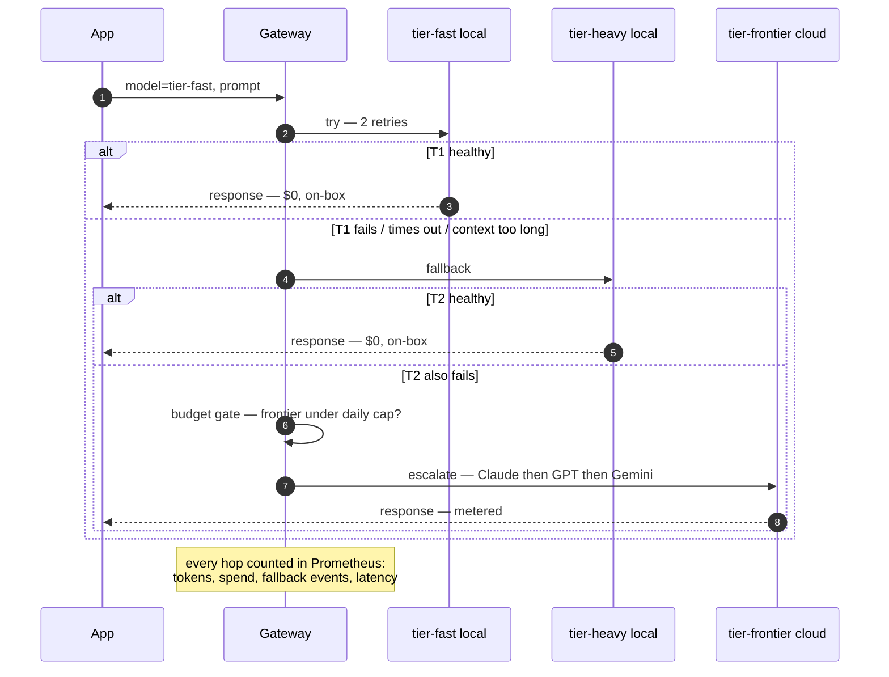

# 🧭 Tiers & Routing

> **What this covers:** how the four tiers work, the fall-through ladder that keeps something always answering, how the ~90/10 split actually happens, and how to point your tools at the gateway.

← Back to [Technical Guide](../getting-started-technical.md) · [Plain-Language Guide](../getting-started-nontechnical.md)

---

## 🎛️ Tiers are aliases; routing is config

The gateway config defines four **aliases**. Clients never name real models — they ask for a *tier*, and your YAML decides what serves it:

| Alias | Serves | Role |
|---|---|---|
| `tier-fast` | local MoE `Qwen3-Coder-30B-A3B` (Ollama) | Default workhorse — the "90%" |
| `tier-heavy` | local dense `Qwen3.6-27B` (Ollama, optionally + vLLM under the same alias) | Harder tasks that still stay on-box |
| `tier-frontier` | Claude Opus → GPT → Gemini (three deployments, one alias); optionally add hosted open-weight leaders | The "10%": budget-capped, auto-failover between providers |
| `tier-private` | local dense `Qwen3.6-27B`, **no fallback chain** | Structurally cannot leave your machine |

> [!NOTE]
> **Repeating an alias creates load-balancing + failover across its deployments** — that's how `tier-frontier` spans three providers and how `tier-heavy` can span Ollama + vLLM.
> `tier-private` appears in **no** fallback chain: that *absence* is the privacy guarantee.

---

## 🪜 The fall-through ladder



Three distinct safety nets stack here:

- 🔁 **Retries** — transient blips.
- 🪜 **Fallbacks** — a tier is down or the prompt overflows its context window (`context_window_fallbacks` up-shifts automatically).
- ⏸️ **Cooldowns** — a deployment failing repeatedly is benched for 30 s (LiteLLM's circuit-breaker analogue).

---

## 💵 Budgets that actually block

Each frontier deployment carries `max_budget` + `budget_duration` (e.g. $3/day for Claude). When a deployment crosses its budget, the gateway stops sending to it for the rest of the period — and because `tier-frontier` has three deployments, exhausting Claude's budget fails over to GPT, then Gemini, then (only when all are exhausted) errors. Spend state lives in Postgres and survives restarts.

Rate caps (`rpm` / `tpm`) sit alongside as burst protection — agentic tools can fire 10–20k-token requests in quick succession, and token-per-minute caps catch what request-per-minute caps miss.

💵 How to set and tune these → [Budgets & Trade-offs](budgets-and-tradeoffs.md).

---

## 📊 Where the "90/10" comes from

Two mechanisms — use either or both.

### Mechanism A — structural (default)
Your *client* decides the tier. Ruflo's complexity router, or your own habit of using `tier-fast` by default, produces the split; the gateway's ladder + budgets enforce the ceiling on frontier usage. Simple, transparent, zero extra latency. The ratio is **emergent**, governed by budget caps rather than targeted precisely.

### Mechanism B — learned (optional `router` profile)
The **RouteLLM** service (LMSYS's open-source framework, ICLR 2025) scores each prompt with a matrix-factorization router and picks strong-vs-weak per request. Its threshold is **calibrated to an explicit strong-model percentage** — the literal 90/10 dial:

```bash
# Inside the routellm container (or any Python env with routellm installed):
python -m routellm.calibrate_threshold --routers mf --strong-model-pct 0.1 \
       --config config.example.yaml
# → prints e.g.  "For 10.0% strong model calls for mf, threshold = 0.24034"
```

Clients then call the RouteLLM endpoint (`http://localhost:6060/v1`) with `model="router-mf-0.24034"`; it forwards to `tier-frontier` or `tier-fast` accordingly, so budgets and metrics still apply downstream. Published results: **>2× cost reduction without quality loss**, up to **85% cost reduction on MT-Bench**.

> [!WARNING]
> Two caveats: calibration is against **Chatbot Arena data** (your true share drifts from the calibrated pct until you re-tune against your own metrics), and the default `mf` router **calls OpenAI for embeddings** — a privacy trade-off (needs `OPENAI_API_KEY` even when both routed models are local).

**Tuning the dial:** start it (`docker compose --profile router up -d`), calibrate with `--strong-model-pct 0.1`, point clients at `:6060/v1`, then **re-calibrate against reality** after a week using your actual frontier share from [Observability](observability.md). Start conservative (5–15%) and inspect outputs before loosening.

RouteLLM repo: https://github.com/lm-sys/RouteLLM · Paper: https://arxiv.org/abs/2406.18665

📖 The deeper "why length ≠ difficulty, and what to do" discussion → [Limitations & Mitigations](limitations-and-mitigations.md).

---

## 🔌 Integrating your tools

### Ruflo / Claude-Flow
Ruflo keeps its complexity scoring and bandit learning; the gateway serves the tiers:

```bash
export CLAUDE_FLOW_ROUTER_OPENROUTER_ALTS=$PWD/ruflo-tiers.json   # ships in this kit
export OPENROUTER_API_KEY=$LITELLM_MASTER_KEY                     # any non-empty value
export OPENROUTER_BASE_URL=http://localhost:4000/v1               # if honored by your version
# Fallback wiring if your ruflo build routes OpenRouter traffic only to openrouter.ai:
export RUFLO_PROVIDER=ollama
export OLLAMA_BASE_URL=http://localhost:4000                      # gateway speaks /v1/chat/completions
export OLLAMA_API_KEY=$LITELLM_MASTER_KEY
```

Because ruflo's Ollama path is a plain OpenAI-compat client with a configurable base URL, pointing it at the gateway means even "ollama" traffic gains fallbacks, budgets, and metrics.

> [!NOTE]
> **Trade-off:** ruflo's per-model bandit labels blur slightly, since it can't see which physical model the gateway chose. Background on this → [Architecture RFC](architecture-rfc.md) and [Evidence Appendix](evidence-appendix.md).

### Anything using the OpenAI SDK
```python
from openai import OpenAI
client = OpenAI(base_url="http://localhost:4000/v1", api_key="<your-virtual-key>")
resp = client.chat.completions.create(model="tier-fast", messages=[...])
print(resp.model)   # tells you which physical model actually served it
```

### Sensitive work
Point it at **`tier-private`**. That alias has no fallback chain and a local-only deployment — a misconfigured budget or a dead local daemon produces an *error*, never a silent cloud escalation. Verify any time with the privacy-pin check in `smoke-test.sh` → [Observability & Testing](observability.md).
